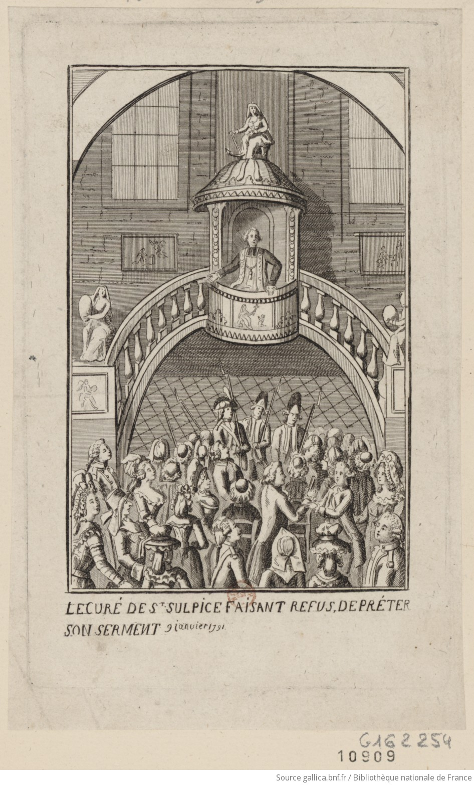

<!--  Copyright (C) 2015-2025 COMITE HISTOIRE ET PATRIMOINE DE CLEGUER / PONT SCORFF -->

# Hyacinthe Chauvel face à la Révolution

Tout va pour le mieux à Lesbin Pont-Scorff, lorsque la tourmente révolutionnaire éclate. Cela fait 21 ans qu’il exerce son sacerdoce dans ces lieux. Prêtre instruit et vertueux, en 1790, ses paroissiens l’élisent premier maire de Lesbin Pont-Scorff, c’est dire l’estime et l’attachement de ses ouailles pour leur pasteur. Cet honneur qu’il vient de revêtir devient une charge bien lourde en cette période de l’histoire. Le recteur-maire est une cible trop visible et les ennemis de l’Église ne manquent pas de saisir l’occasion pour frapper.

A cette époque, on rêvait d’une église nationale et d’un sacerdoce simple fonction d’état. Le 2 juin 1790, le gouvernement révolutionnaire, appliquant les décrets antérieurs, oblige prêtres et desservants de paroisse à lire publiquement au prône tous les actes émanant de l’assemblée constituante. Ce fut le point de départ des difficultés de M. Chauvel.

Le 3 septembre 1790, le recteur-maire Chauvel reçoit du directoire du district d’Hennebont un courrier lui signifiant que s’il refuse de faire, à haute et intelligible voix, lecture des publications des décrets de l’Assemblée nationale, il sera déclaré incapable de remplir la fonction de citoyen actif.

A ce courrier, le recteur répond : « je me suis fait un devoir de publier les décrets de l’Assemblée nationale. J’avoue, Messieurs que je ne les lis pas tous en entier, ce qui me paraît si difficile, je me borne à donner au peuple le précis des décrets et invite les autres à lire les affiches ».

Le 27 novembre 1790, un décret oblige les fonctionnaires et les chefs de paroisse à prêter un rigoureux serment de fidélité à la constitution civile du clergé dont le but est de laïciser l’Eglise et d’en faire une religion purement civile.

En janvier 1791, l’ensemble des officiers municipaux, de l’assemblée municipale et du corps politique sont convoqués afin d’officialiser la prestation de serment et de délivrer aux ecclésiastiques un certificat d’existence des fonctions qu’ils remplissent.

Cette réunion (plus de 20 personnes) a lieu le 16 janvier dans la sacristie de Lesbin. M. Chauvel, Maire, prit la parole et déclara que le serment ne pouvait se faire sans blesser sa conscience et que ce décret concernant la constitution civile du clergé, attaquant les droits du pape et des évêques, ne pouvait être de la compétence de l’Assemblée nationale. En conséquence, il refusait absolument de prêter le serment. Son frère, le curé Pierre Chauvel, a fait le même refus. En revanche, le curé de la trêve de Gestel, le Sieur Bardoul, a prêté le serment en public.

M. Hyacinthe Chauvel est donc déclaré réfractaire et doit être remplacé. Le 3 avril 1791, l’assemblée électorale du district d’Hennebont procède à l’élection d’un nouveau recteur. C’est M. Le Lièvre, prêtre de Lorient qui est élu Recteur de Lesbin Pont-Scorff Gestel. Son installation officielle a lieu le 26 juin 1791 au bourg de Lesbin. A cette occasion, les membres du directoire se rendent chez M. Chauvel pour lui déclarer qu’à l’avenir il n’est plus rien dans la paroisse et qu’il est dépossédé de tous ses biens. Il avait célébré son dernier baptême le 23 juin 1791 dans cette église de Lesbin.

*Le Curé de St Sulpice faisant refus de préter son serment : 9 janvier 1791, estampe, auteur non identifié. BnF Gallica, cote ark:/12148/btv1b8411297n*

---

Un texte de Joël Nevannen

Source : Histoire d'un prêtre Morbihannais pendant la révolution, Vincent Jeffrédo.

Publié sur [la page Facebook du Comité d'Histoire](https://www.facebook.com/comitehistoire56620) le 17 mars 2024.

Copyright &copy; Comité Histoire et Patrimoine de Cléguer Pont-Scorff
