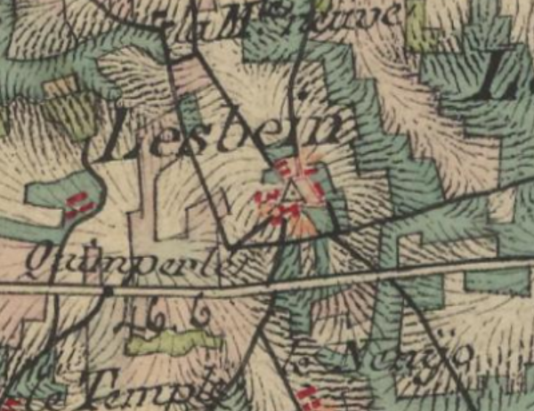

<!--  Copyright (C) 2015-2025 COMITE HISTOIRE ET PATRIMOINE DE CLEGUER / PONT SCORFF -->

# Lesbin (Pont-Scorff)

Il existe deux explications, une assez répandue et une autre moins connue mais basée sur des découvertes récentes.

L’explication la plus répandue suppose que Lesbin serait une forme raccourcie de “Les Aubin”. En effet ce “Les” viendrait de “Lis” qui veut dire “habitation enclose” en vieux breton et au début du moyen breton. De plus, c'est dans ce village qu’on trouve  l'église dédiée à Saint Aubin.

Récemment, des chercheurs ont étudié des manuscrits comportant des graphies plus anciennes et qui permettent de proposer une autre explication.

- Parrochia de Lebin 1167, 
- Parroesse de Lebin de 1382 à 1444, 
- Lebin 1445, Leubin Pontscorff 1448,
- Lebin 1452 à 1591,
- Lesbin et Lebin de 1600 à 1636, 
- Paroisse de Leubin 1640,
- Lesbin de 1642 à 1683, 
- Lesvin 1785, 
- Pont-Scorff Lesbeins 1818 (voir illustration ci-dessous).

Les graphies les plus anciennes “Lebin” pourrait avoir pour origine le nom ou surnom d’un chef breton “Lebilin” signifiant "Chef Brillant".

Sinon, il pourrait venir du nom “Leubinus”, moine poitevin, mort évêque de Chartres en 557. Ce nom qui a évolué en “ Lubin” est présent dans les côtes d’Armor ainsi qu’à Guiscriff. On peut se demander pourquoi il aurait évolué différemment ici.

Ce n’est qu’au XVIIe siècle que l’on voit apparaître « Lesbin » avec comme premier élément “Les” (’habitation enclose). Le deuxième élément a été assimilé à cette époque à Saint Aubin. Or déjà en 1167 c’était Lebin et non pas Lesbin.

*Carte de l'état-major (1820-1866), IGN*

---

Un texte de Michel Pothier. 

Source: « Des sources de l’Ellé à l’Île de Groix », Jean-Yves Plourin et Pierre Hollocou, édition Emgleo Breiz, 2014.

Publié sur [la page Facebook du Comité d'Histoire](https://www.facebook.com/comitehistoire56620) le 22 mars 2024.

Copyright &copy; Comité Histoire et Patrimoine de Cléguer Pont-Scorff
