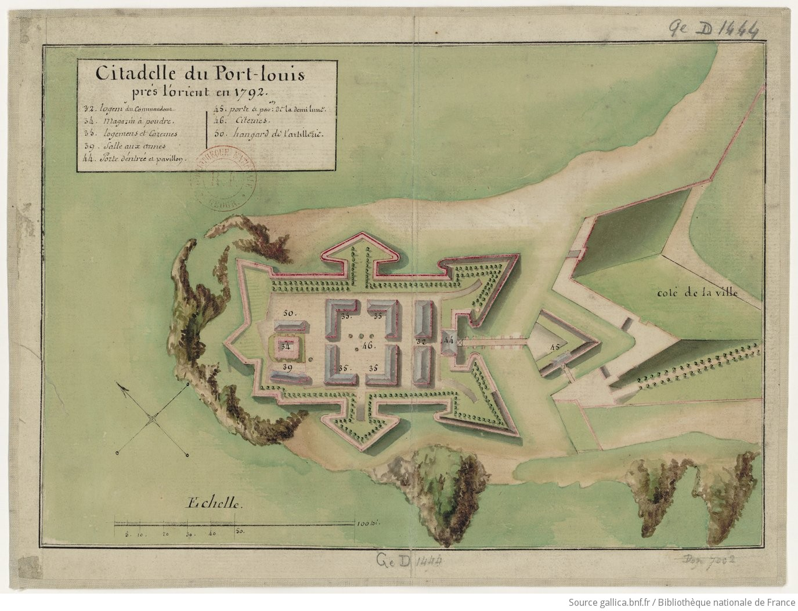

<!--  Copyright (C) 2015-2025 COMITE HISTOIRE ET PATRIMOINE DE CLEGUER / PONT SCORFF -->

# Hyacinthe Chauvel : Exil et arrestation

Le 2 juillet 1791, Hyacinthe et Pierre Chauvel se retirent à Guémené-sur-Scorff dans la maison familiale. Ils sont accueillis par la municipalité avec bienveillance. Pour le district d’Hennebont, ils sont déclarés en fuite. Le commissaire Lapotaire de Lorient va traquer sa proie afin de se rendre célèbre aux yeux des chefs révolutionnaires.

Les exilés trouvent auprès des directeurs du district de Pontivy et de la municipalité de Guémené une hospitalité généreuse et protectrice. 

Le 15 juin 1792, Le capitaine Beysser de la gendarmerie d’Hennebont reçoit l’ordre d’arrêter 70 ecclésiastiques dont Hyacinthe Chauvel. Il ne réussit à en interpeller que 5.

Dès lors le pouvoir judiciaire du district de Pontivy, en accord avec la municipalité de Guémené-sur-Scorff, entre en compétition avec la gendarmerie et obtint le maintien en liberté de M. Chauvel, témoignant qu’en aucune manière, ils n’occasionnent de troubles à l’ordre public. Les paroissiens de Pont-Scorff, fidèles à leur ancien recteur, effectuent le voyage en nombre jusqu’à Guémené afin d’être confessés par M. Hyacinthe Chauvel.

Le 14 août 1792, la situation du clergé s’aggrave nettement, un décret ordonne l’internement et la déportation des prêtres réfractaires. En application de ce décret, le capitaine Beysser se rend à Guémené pour procéder à l’arrestation de M. Chauvel. Cependant, ne présentant un ordre écrit seulement signé par lui-même, la municipalité refuse de lui livrer les réfractaires.

Le 19 août 1792, après plusieurs échanges de courrier, le Directoire du département de Vannes rompt le silence et ordonne l’arrestation des prêtres réfractaires, les qualifiant d’être des hommes infiniment dangereux. Hyacinthe Chauvel est un personnage de premier choix pour le commissaire Lapotaire, il oubliera de citer Pierre Chauvel sur l’ordre d’arrestation. Le 22 août 1792, la municipalité de Guémené obtint l’accord d’accompagner eux-mêmes les réfractaires dont M. Chauvel jusqu’à la citadelle de Port-Louis ou ils furent incarcérés, Hyacinthe Chauvel, âgé de 61 ans échappe à la déportation. Ils arrivent à Port-Louis le 24 août 1792.

*Citadelle du Port-Louis près Lorient en 1792. BnF / Gallica, ark:/12148/btv1b84403392*

---

Un texte de Joël Nevannen

Source : Histoire d'un prêtre Morbihannais pendant la révolution, Vincent Jeffrédo.

Publié sur [la page Facebook du Comité d'Histoire](https://www.facebook.com/comitehistoire56620) le 31 mars 2024.

Copyright &copy; Comité Histoire et Patrimoine de Cléguer Pont-Scorff
