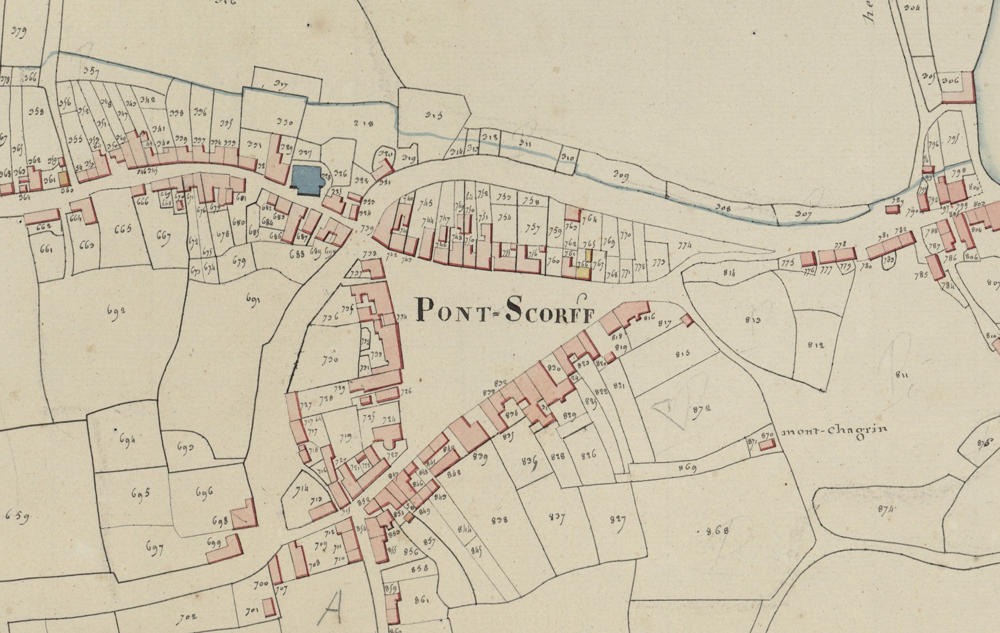

<!--  Copyright (C) 2015-2025 COMITE HISTOIRE ET PATRIMOINE DE CLEGUER / PONT SCORFF -->

# Pont-Scorff

Ce n’est qu’au XIXe siècle qu’un lexicographe voulant à tout prix donner une signification au nom « Scorff » le définit comme étant  une décharge de l’eau superflue d’un étang. Drôle de nom pour une rivière.

En 2014, Jean-Yves Plourin et Pierre Hollocou donnèrent une définition pertinente de Pont-Scorff. Les premières graphies connues de la commune sont Ponscorf 1235 (Dom Morice) et Pons Scorvi 1280 (Rosenzweig). Il semblerait que l’écriture Pons Scorvi soit due à une fausse coupe. Comme souvent à l’époque où la communication est essentiellement verbale, la consonne finale du premier élément est dupliquée et se retrouve également au début du deuxième élément comme par exemple Saint Richau devient rapidement Saint Trichau et Saint Hurien se transforme en Saint Thurien. On trouve couramment dans les textes anciens et ce jusqu’au XVIIIe siècle l’écriture Ponscorff.

Si l’on admet cette évolution cela donnerait Pons Corvi qui en français se traduit par Pons = Pont et Corvi qui est le génitif de Corvus = Corbeau. Pont-Scorff pourrait se définir comme étant le “Pont du Corbeau" ou “Pont Bran” en breton. Chez les celtes, le grand corbeau (Corvus) est très présent aussi bien dans les noms de personnes que dans les noms de lieux. Le long du Scorff, on trouve La Métairie en Meslan qui est un ancien Menez Bran (XVIe) et Kervran en Guilligomarch’ qui est Kerbran en 1409. En aval de Pont-Scorff, nous avons les vestiges d’un camp retranché au lieu-dit le Rocher du Corbeau.

Cette explication de l’étymologie de Pont-Scorff semble être la plus cohérente de celles qui ont été présentées jusqu’à présent. Mais cela amène une autre énigme de taille : quel était alors le nom de cette rivière qui coule sous ce pont ?

*Cadastre napoléonien - Commune de Pont-Scorff, Section C du Bourg, 2e feuille, 1818. Patrimoines & Archives du Morbihan cote 3 P 225 9.*

---

Un texte de Michel Pothier. 

Source: « Des sources de l’Ellé à l’Île de Groix », Jean-Yves Plourin et Pierre Hollocou, édition Emgleo Breiz, 2014.

Publié sur [la page Facebook du Comité d'Histoire](https://www.facebook.com/comitehistoire56620) le 5 avril 2024.

Copyright &copy; Comité Histoire et Patrimoine de Cléguer Pont-Scorff
