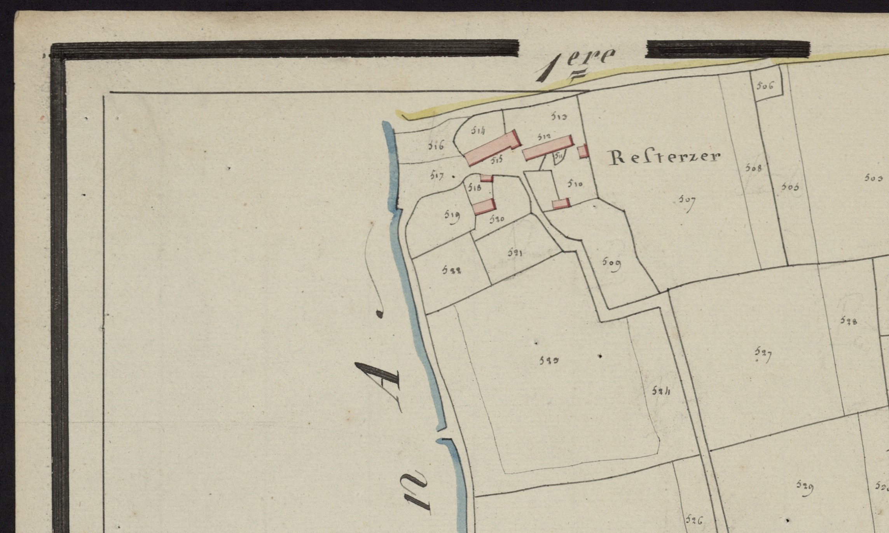

<!--  Copyright (C) 2015-2025 COMITE HISTOIRE ET PATRIMOINE DE CLEGUER / PONT SCORFF -->

# Restrezech (Pont-Scorff)

Pour le village de Restrezerch nous trouvons les graphies suivantes :

 - Restansech 1446, 
 - Restensech 1499, 1592, 
 - Restersech 1614, 
 - Restreseh 1661, 
 - Restersech 1671, 
 - Restresech 1683, 
 - Restersech 1754, 
 - Restrezech 1790, 
 - Resterzer cadastre de 1818.

L’écriture la plus ancienne associe “Rest” et “An Sech”. Rest peut signifier: lieu de repos, demeure ou essart de lande. Il semble que “essart de lande” soit la signification la plus probable, c'est-à-dire un terrain qui était autrefois occupé par la lande et qui a été défriché.

Effectivement il y avait au moyen âge une lande de 125 journaux qui se nommait Le Restou en 1430, la grande lande du Resto en 1754 ou encore le ruisseau de Lann Resto. Cette lande s'étendait entre Brétaudis, Mané Billy et Bourcicogne et était traversée par le grand chemin de Pont-Scorff au Faouët. Aujourd’hui encore on utilise le nom de Lann Resto pour désigner le bois et les champs au nord de Restrezech, là où se trouve actuellement le Camping Entre Terre et Mer

Le village se trouvant en bordure d'une grande lande, il s'est probablement implanté dans un endroit défriché. 

Quand a “An Sech” on pense qu’il s'agit du nom de famille Le Sech. En effet, le “an” comme le “n” devant un nom propre signifie “le”.  Le nom Le Sech fait partie des noms liés à une particularité physique. Ainsi Le Sech signifie Le Sec comme Le Teuff signifie Le Gros.

Il est à remarquer que l’écriture du nom de ce village hésite continuellement entre Restresech et Restersech.

*Cadastre dit Napoléonien, Commune de Pont-Scorff, Section C du Bourg, 2e feuille, 1818. Patrimoines & Archives du Morbihan cote 3 P 225 9*

---

Un texte de Michel Pothier. 

Source: « Des sources de l’Ellé à l’Île de Groix », Jean-Yves Plourin et Pierre Holloco, édition Emgleo Breiz, 2014.

Publié sur [la page Facebook du Comité d'Histoire](https://www.facebook.com/comitehistoire56620) le 19 avril 2024.

Copyright &copy; Comité Histoire et Patrimoine de Cléguer Pont-Scorff
