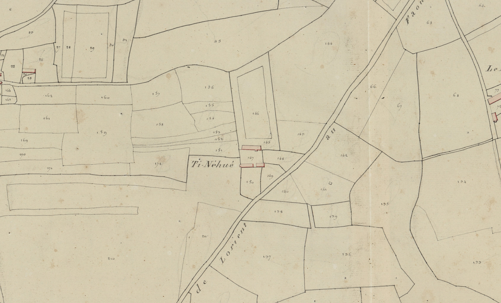

<!--  Copyright (C) 2015-2025 COMITE HISTOIRE ET PATRIMOINE DE CLEGUER / PONT SCORFF -->

# Ty Néhué (Pont-Scorff)

A l’origine ce village portait un nom français : Maison Neuf 1771, La Maison Neuve 1790, Tineuhué cadastre de 1818.

Ce lieu-dit sur le grand chemin de Quimperlé à Pont-Scorff est d’abord transcrit en français puis repris en breton dans les documents à partir de 1818.
En breton “Ty” se traduit bien par “maison” et “nevez” (prononcer “néwé”) par “neuf”

*Cadastre napoléonien - Section D de Kermorvant, 1re feuille, 1818. Patrimoines & Archives du Morbihan cote 3 P 225 11*

---

Un texte de Michel Pothier. 

Source: « Des sources de l’Ellé à l’Île de Groix », Jean-Yves Plourin et Pierre Holloco, édition Emgleo Breiz, 2014.

Publié sur [la page Facebook du Comité d'Histoire](https://www.facebook.com/comitehistoire56620) le 26 avril 2024.

Copyright &copy; Comité Histoire et Patrimoine de Cléguer Pont-Scorff
