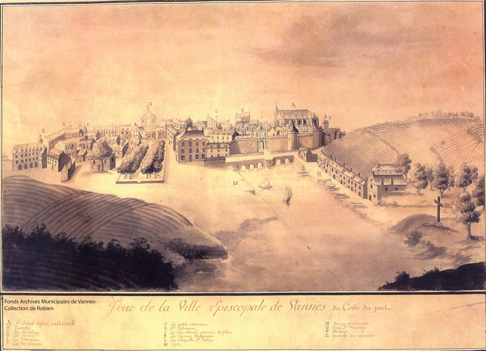

<!--  Copyright (C) 2015-2025 COMITE HISTOIRE ET PATRIMOINE DE CLEGUER / PONT SCORFF -->

# Hyacinthe Chauvel : Pacification et fin de vie

Le coup d’état du 10 novembre 1799 (18 brumaire) renverse le Directoire qui s’était, par ses vexations odieuses, attiré la haine publique. Le général Bonaparte, premier des trois consuls venait de « déchirer » la constitution de l’an III. Puis, par un arrêté du 21 novembre 1799, demande la libération des prêtres. Les autorités consulaires conjurent les représentants locaux de ramener la paix en autorisant la liberté du culte et la tolérance religieuse.

Le 25 décembre 1799, Hyacinthe Chauvel, en son nom et au nom de ses confrères détenus au Petit-Couvent de Vannes, rédigea de sa main une pétition pour demander « Puisque nous avons le bonheur de voir renaître l’espoir de la paix, de la justice et de l’humanité, veuillez nous en faire ressentir les effets en nous délivrant de la détention sous laquelle nous gémissons ». La réponse des autorités ne se fit pas attendre, Les prêtres sont immédiatement remis en liberté. Dans un premier temps, ils sont contraints de rester à Vannes, hébergés par des personnes bienveillantes sous la surveillance de la police de cette cité. Ironie de l’Histoire : le jour-même, (25 décembre 1799) Jean Gabriel Lapotaire, l’homme qui a poursuivi Hyacinthe Chauvel sans relâche pendant 10 ans et à l’origine de ses souffrances, est élu député du Morbihan et rejoint l’assemblée Nationale.

Le pays a grand besoin de paix, aussi, pour obtenir ce résultat, le gouvernement devait inévitablement faire appel aux prêtres réfractaires, mais la révolution qui les avait traqués, volés, emprisonnés, et bannis avait certainement laissé au fond de leur cœur une animosité compréhensible. Il fallait donc commencer par les pacifier eux-mêmes. C’est naturellement que l’autorité s’adressa à celui sur lequel Lapotaire n’avait cessé de déverser sa haine.

Le général Brune, commandant en chef de l’armée de l’Ouest et conseiller d’état, choisit comme pacificateur M. Hyacinthe Chauvel, l’homme sage entre tous, dont l’administration départementale connaissait le courage, l’énergie, la vie édifiante, le patriotisme intact et éprouvé et qui jouissait d’un grand crédit parmi ses confrères. A la suite de pourparlers avec le général Brune, le recteur de Pont-Scorff accepta de remplir le rôle qu’on lui offrait. A la demande du général, un passeport est établi au nom du citoyen Chauvel afin qu’il regagne Pont-Scorff, ou est son domicile, qu’il y prêche la paix et l’amour de l’ordre. Ce passe invite tous les fonctionnaires et les autorités administratives à le laisser librement circuler et à lui prêter aide et assistance. Sa mission, au-delà d’exercer son ministère religieux, consistait à entrer en relation avec ses confrères réfractaires afin de les convaincre de reprendre le chemin des églises, fermées depuis si longtemps. M. Chauvel se mit à l’œuvre non sans difficultés et parcourra la région pour ramener l’ordre et la paix. 

Au cours des 10 années de la révolution, l’abbé Chauvel aura passé 5 ans et 10 mois de captivité en trois séjours distincts et dans 10 prisons différentes.

Le 18 mars 1806, Hyacinthe Chauvel décède à Pont-Scorff, à l’âge de 74 ans.

*Vue de la ville épiscopale de Vannes du costé du port, 1745. Tous droits réservés Archives municipales de VANNES, Collection de Robien, cote 23Fi14.*

---

Un texte de Joël Nevannen

Source : Histoire d'un prêtre Morbihannais pendant la révolution, Vincent Jeffrédo.

Publié sur [la page Facebook du Comité d'Histoire](https://www.facebook.com/comitehistoire56620) le 28 avril 2024.

Copyright &copy; Comité Histoire et Patrimoine de Cléguer Pont-Scorff
