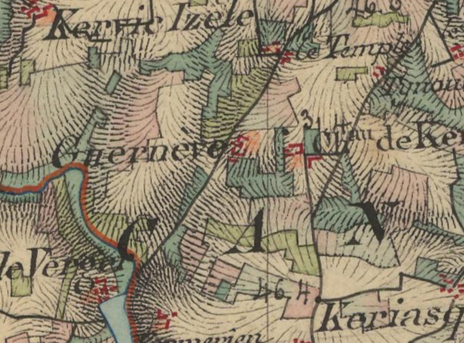

<!--  Copyright (C) 2015-2025 COMITE HISTOIRE ET PATRIMOINE DE CLEGUER / PONT SCORFF -->

# La Villeneuve (Pont-Scorff)

Comme pour Ty-Nehue, le nom de cet endroit s’est écrit en breton à partir de 1818, mais actuellement il est revenu au français. Voici la liste des graphies qui ont pu être retrouvées pour ce lieu:

 - La Villeneuffve de 1445 à 1668
 - La Villeneufve 1671
 - La Villeneuve 1689
 - La Villeneuffve 1720
 - La Villeneuffe 1730
 - La Villeneuve 1731
 - K/Nevé 1752 et 1753
 - La Villeneuve de 1762 à 1790, 
 - Guernévé cadastre de 1818.

*Carte de l'état-major (1820-1866) IGN*

---

Un texte de Michel Pothier. 

Source: « Des sources de l’Ellé à l’Île de Groix », Jean-Yves Plourin et Pierre Holloco, édition Emgleo Breiz, 2014.

Publié sur [la page Facebook du Comité d'Histoire](https://www.facebook.com/comitehistoire56620) le 17 mai 2024.

Copyright &copy; Comité Histoire et Patrimoine de Cléguer Pont-Scorff
