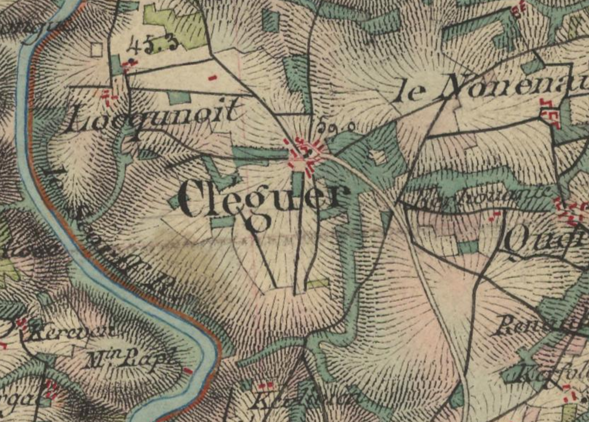

<!--  Copyright (C) 2015-2025 COMITE HISTOIRE ET PATRIMOINE DE CLEGUER / PONT SCORFF -->

# Cléguer

Cléguer est un nom de lieu assez répandu. On en compte une vingtaine en Bretagne mais seulement trois dans le Morbihan. Un seul possède le rang de chef-lieu communal, c’est celui qui nous intéresse aujourd’hui.

Voici quelques graphies relevées dans des documents anciens:
 - Cleker 1160
 - Clecguer XIIe siècle – Abbaye Sainte Croix de Quimperlé
 - Clequer parrochia 1280
 - Cléguer XVe siècle

Quant à sa signification, il y a deux interprétations :

L’une associerait l’idée d’un « Clod » vieux breton, évoluant en Cleuz, Cleu et Cle (dans le sens d’enclos) avec le nom du saint en admettant que Saint Gérand, le patron de la paroisse et Saint Guérec ne font qu’un. Ce qui n’est pas du tout prouvé. L’un serait à l’origine Kieran et l’autre Kirec et l’on a pour l’un comme pour l’autre des légendes différentes. Il se pourrait cependant qu’une certaine homophonie ait fait accepter l’un pour l’autre.

L’autre interprétation fait appel à un vieux mot celtique « klog » qui se traduit par rocher ou plutôt entassement rocheux, chaos, produisant « Kléguer » au pluriel.
Pour justifier cette proposition, on se réfère à de nombreux lieux-dits Cléguer. En Bretagne on les trouve surtout dans le Léon. Il y en a aussi Outre-Manche : « Clegyr » au Pays de Galles ou « Clegar » en Cornwall. L’absence en ces lieux de chapelle ou de tradition concernant un Saint Guérec ou Gérand est de nature à confirmer cette version.

Carte de l'état-major (1820-1866), IGN

---

Un texte de Michel Pothier.

Source : « Secrets & mystères de nos Kêr - Tome 1 » par Job Jaffré.

Publié sur [la page Facebook du Comité d'Histoire](https://www.facebook.com/comitehistoire56620) le 24 mai 2024.

Copyright &copy; Comité Histoire et Patrimoine de Cléguer Pont-Scorff
