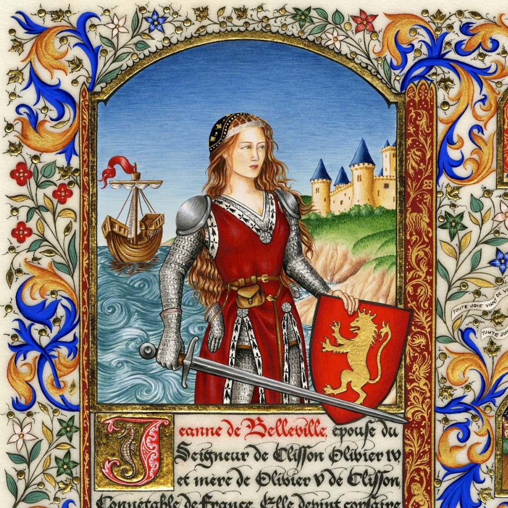
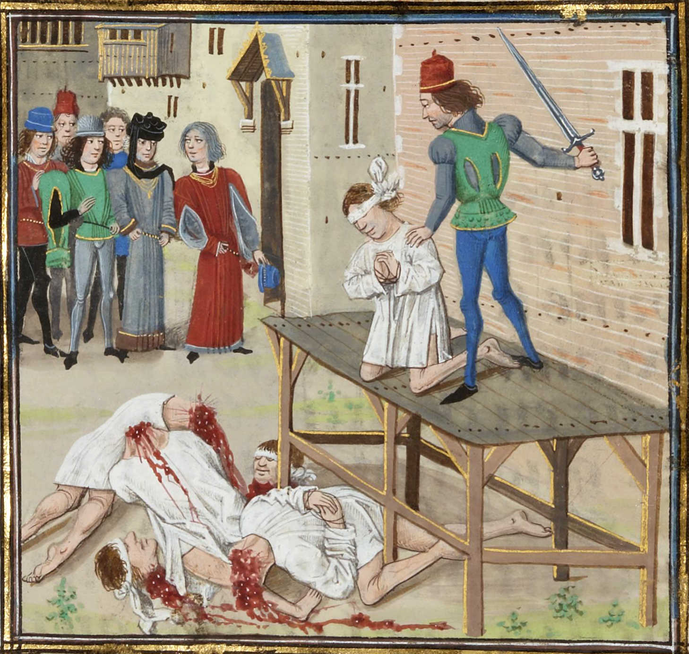
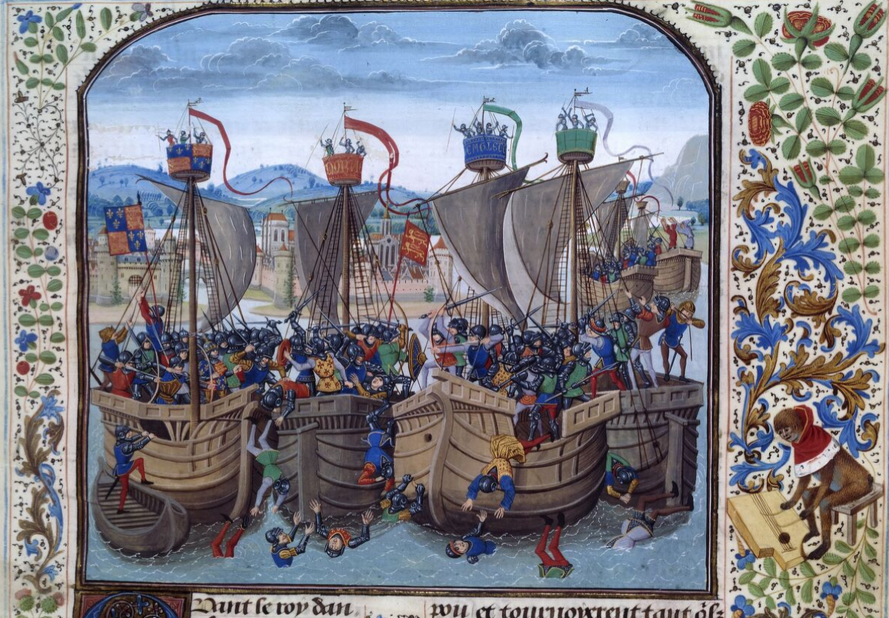

<!--  Copyright (C) 2015-2025 COMITE HISTOIRE ET PATRIMOINE DE CLEGUER / PONT SCORFF -->

# Jeanne de Belleville, la Tigresse Bretonne

Jeanne est née en 1300 dans une famille noble du Poitou. Mariée en 1312 avec Geoffroy de Chateaubriant, veuve à 26 ans, elle épouse en seconde noce Olivier de Clisson, grand seigneur féodal, issu de la puissante famille de Bretagne.

En 1343, ce dernier est invité par le roi à Paris pour participer à un tournoi. A peine arrivé, le roi Philippe VI, au mépris des règles de chevalerie, le fait arrêter pour haute trahison. Exécuté sans jugement, son corps est accroché aux fourches patibulaires de Montfaucon à Paris tandis que sa tête, plantée sur une pique, est exhibée à la vue des passants sur la porte Sauvetout à Nantes.

Folle de rage, Jeanne conduit ses deux fils devant la tête de leur père et leur fait jurer vengeance.

Sans tarder, avec une petite troupe, elle attaque, pille et saccage une demi-douzaine de châteaux appartenant à des fidèles du roi de France. Ensuite, elle arme une flotte et prend à l’abordage tous les bateaux français qu’elle croise. Les équipages sont systématiquement massacrés. Elle gagne rapidement les surnoms de « Tigresse bretonne » ou « Lionne sanglante ».

« La lutte est ouverte entre nous, roi puissant, et tu seras cruel vaincu par une femme. Je porterai partout et la mort et la flamme. Et ne m’accuse pas ! Je fais ce que tu fis. Heureuse de venger mon époux et mes fils. » (Biographie de Jeanne de Belleville)

Au cours d’une rencontre avec la flotte française, son navire est coulé. Elle parvient à s’enfuir à bord d’une barque avec ses deux fils. Au cours de ce périple l’un d’eux meurt de soif et d’épuisement.

Elle parvient à s’enfuir à bord d’une barque avec ses deux fils. Au cours de ce périple l’un d’eux meurt de soif et d’épuisement. Arrivée en Angleterre, elle est accueillie à bras ouverts. Son but est de récupérer ses terres confisquées par de roi de France pour les transmettre à Olivier, seul fils survivant. Pour cela, elle épouse Gautier de Bentley, commandant les troupes anglaises en Bretagne, qui aide Jean IV de Monfort à récupérer le Duché de Bretagne. Une fois Duc de Bretagne, Jean IV la récompense ainsi que Bentley en leur faisant don de la seigneurie de la Roche Moisan. La seigneurie de la Roche Moisan dont la sénéchaussée (pouvoir judiciaire et fiscal) était implantée à Pont-Scorff dans le bâtiment qui deviendra plus tard la Maison des Princes.

« La baronnie de la Roche Moisan et ses appartenances à notre très cher et très aimé monsour Gautier de Bentelé et à notre très chère cousine, la dame de Belleville et de Cliczon, sa compaigne et épouse, et à notre très cher et très aimé cousin monsour Olivier, sire de Cliczon (leur fils) et aux loirs qui ystront de lui. »

Son fils Olivier, se réconciliera avec le nouveau roi de France, Charles V, et deviendra connétable de France. Digne fils de sa mère, sa cruauté envers ses ennemis le fera surnommer « Le Boucher ».

*Enluminure "Jeanne de Belleville" création par Elsa Millet, pigments et feuille d'or sur parchemin, 2012. - Elsa Millet Enluminure*

*Exécution d'Olivier IV de Clisson, tiré de la Chronique de Jean Froissart (ms fr. 2643, fol° 126r), enluminure de Loyset Liédet. BnF Gallica, cote ark:/12148/btv1b84386043*

*La bataille de l’Écluse, tiré de la Chronique de Jean Froissart (ms fr. 2643, fol° 72r), enluminure de Loyset Liédet. BnF Gallica, cote ark:/12148/cgfbt42150b*

---

Un texte de Michel Pothier.

Publié sur [la page Facebook du Comité d'Histoire](https://www.facebook.com/comitehistoire56620) les 26 mai, 2 juin et 9 juin 2024.

Copyright &copy; Comité Histoire et Patrimoine de Cléguer Pont-Scorff
