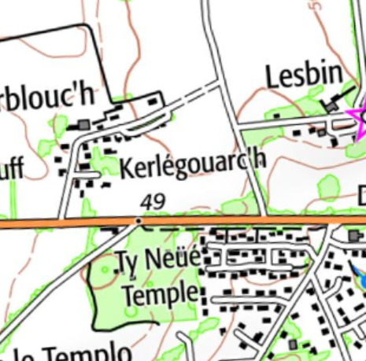

<!--  Copyright (C) 2015-2025 COMITE HISTOIRE ET PATRIMOINE DE CLEGUER / PONT SCORFF -->

# Kerlegouarch

Ce toponyme est récent car il n’est pas sur le cadastre de 1818.

Il associe Ker avec le nom de famille Helgouarc’h qui fait partie des noms bretons liés à l’amitié. “Hel” vient de “Hael” qui signifie "généreux”. “gouarc’h” vient de “comarch” qui peut se traduire par “salutation, souhait” (équivalent de greet en anglais).

*Carte IGN*

---

Un texte de Michel Pothier. 

Source: « Des sources de l’Ellé à l’Île de Groix », Jean-Yves Plourin et Pierre Holloco, édition Emgleo Breiz, 2014.

Publié sur [la page Facebook du Comité d'Histoire](https://www.facebook.com/comitehistoire56620) le 14 juin 2024.

Copyright &copy; Comité Histoire et Patrimoine de Cléguer Pont-Scorff
