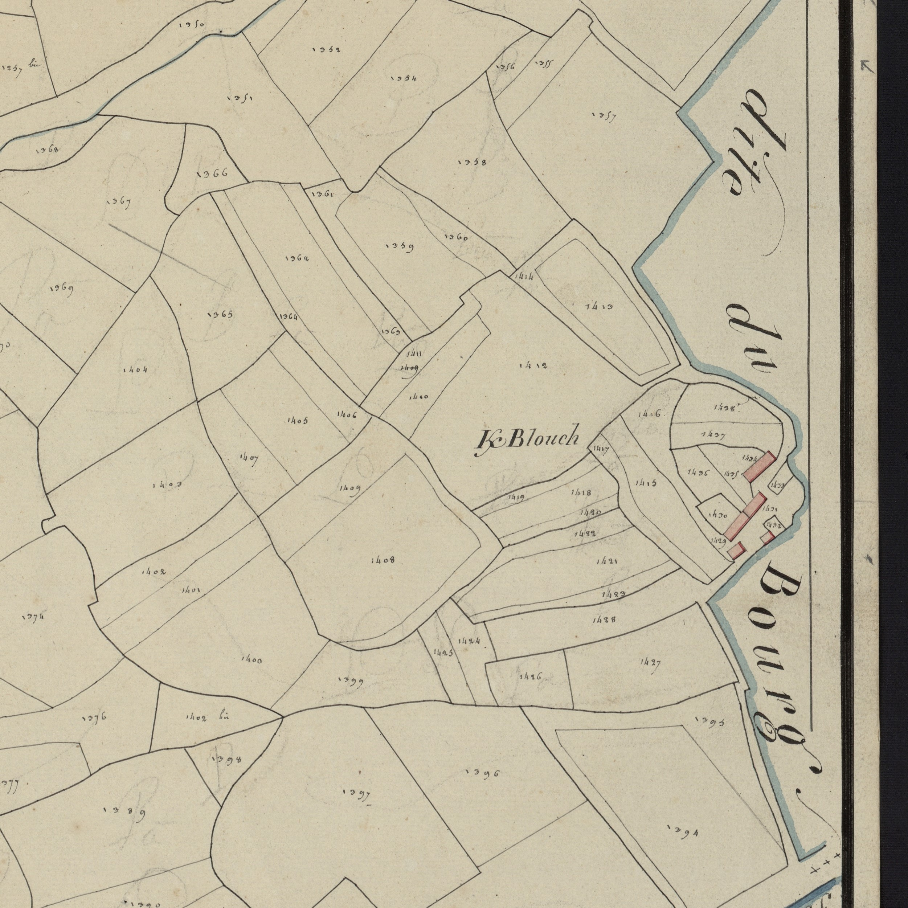

<!--  Copyright (C) 2015-2025 COMITE HISTOIRE ET PATRIMOINE DE CLEGUER / PONT SCORFF -->

# Kerblouch (Pont-Scorff)

Ce toponyme est ancien. En effet la première graphie relevée K/anblouch remonte à 1426. Elle ne varie pas beaucoup au cours des années sauf à partir de 1642 le “an” (Le) de K/anblouch disparaît pour donner K/blouch.

Ce nom de lieu associe ker au nom de famille An Blouch, Blouc’h variante de Bloc’h qui s’applique à une personne imberbe, glabre.

*Cadastre napoléonien - Section A de Kerlau, 3eme feuille, 1818. Archives départementales du Morbihan cote 3 P 225 5*
---

Un texte de Michel Pothier. 

Source: « Des sources de l’Ellé à l’Île de Groix », Jean-Yves Plourin et Pierre Holloco, édition Emgleo Breiz, 2014.

Publié sur [la page Facebook du Comité d'Histoire](https://www.facebook.com/comitehistoire56620) le 21 juin 2024.

Copyright &copy; Comité Histoire et Patrimoine de Cléguer Pont-Scorff
