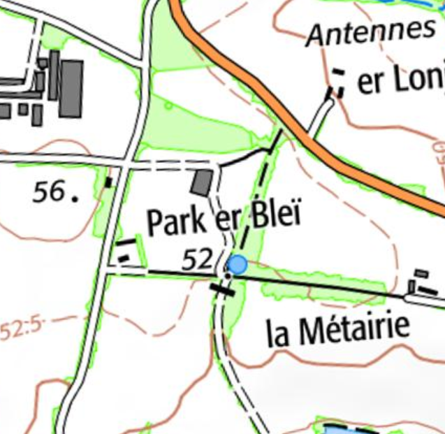

<!--  Copyright (C) 2015-2025 COMITE HISTOIRE ET PATRIMOINE DE CLEGUER / PONT SCORFF -->

# Parc er Blay (Pont-Scorff)

On sait que le nom Parc er Blay existe déjà en 1753 mais il n'apparaît pas sur le cadastre de 1818 qui ne mentionne pas le nom des champs.

Ce toponyme associé “parc” (champ) et le nom de famille Le Blaye qui est une variante de Bleiz qui signifie loup en breton. Il pourrait donc s’appeler également le Champ du Loup.

*Carte SCAN25 © IGN 2024 – Copie et reproduction interdite*

---

Un texte de Michel Pothier. 

Source: « Des sources de l’Ellé à l’Île de Groix », Jean-Yves Plourin et Pierre Holloco, édition Emgleo Breiz, 2014.

Publié sur [la page Facebook du Comité d'Histoire](https://www.facebook.com/comitehistoire56620) le 28 juin 2024.

Copyright &copy; Comité Histoire et Patrimoine de Cléguer Pont-Scorff
