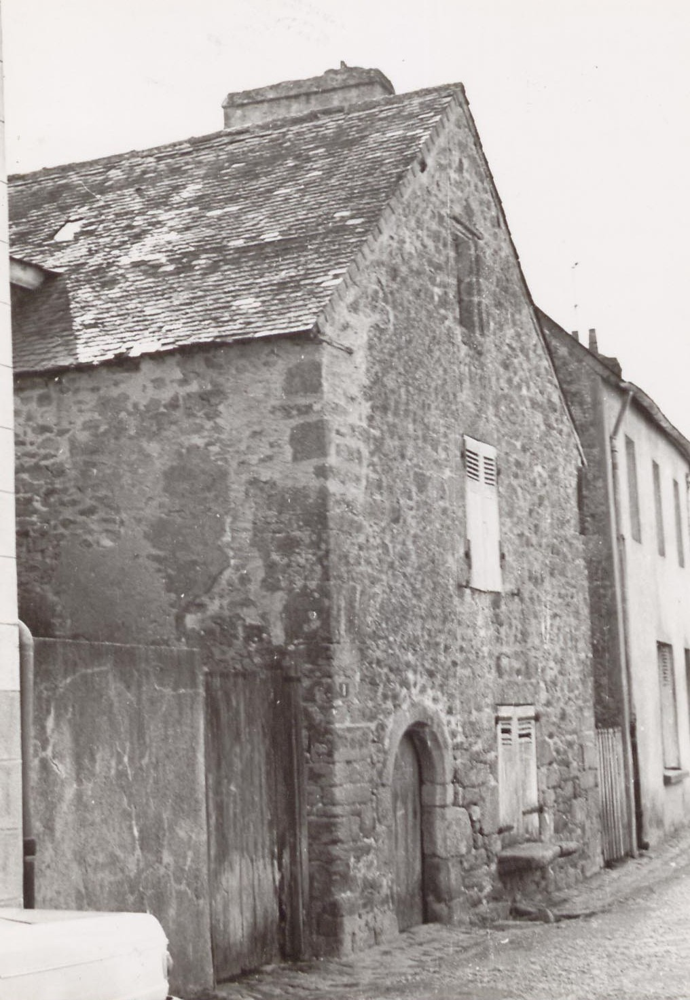
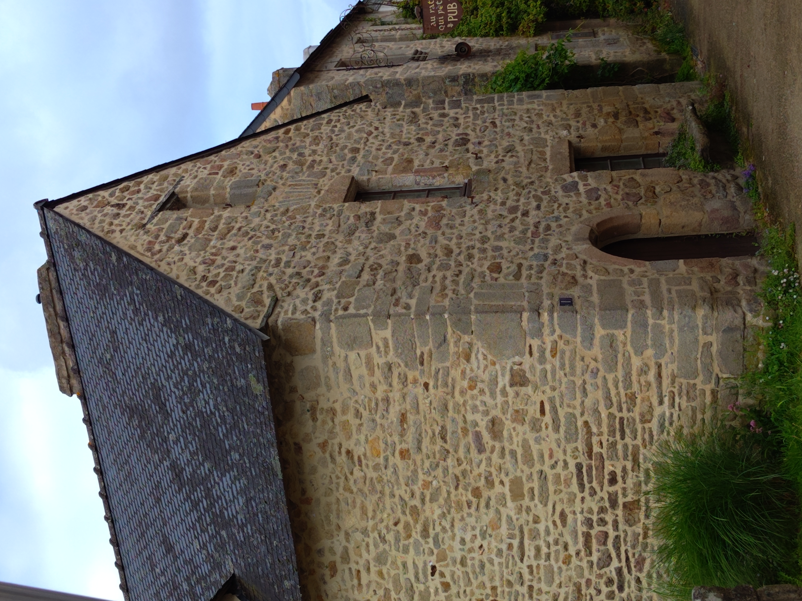

<!--  Copyright (C) 2015-2025 COMITE HISTOIRE ET PATRIMOINE DE CLEGUER / PONT SCORFF -->

# 1 rue Terrien

Au premier plan, l’aile nord de l’Atelier d’Estienne qui hébergeait à la fin des années 90 la médiathèque. Au second plan on voit le bar Au Rat Qui Pète.

🔜 Cet été, nous vous proposeront chaque dimanche une photo, carte postale ou illustration d’un lieu de Cléguer ou de Pont-Scorff. N’hésitez pas à vous abonner à notre page pour ne rien rater des publications futures.

*En 1970, photo des Archives du Morbihan*

*En 2024, photo de Pierre-Loup Tristant*
---

Publié sur [la page Facebook du Comité d'Histoire](https://www.facebook.com/comitehistoire56620) le 5 juillet 2024.

Copyright &copy; Comité Histoire et Patrimoine de Cléguer Pont-Scorff
