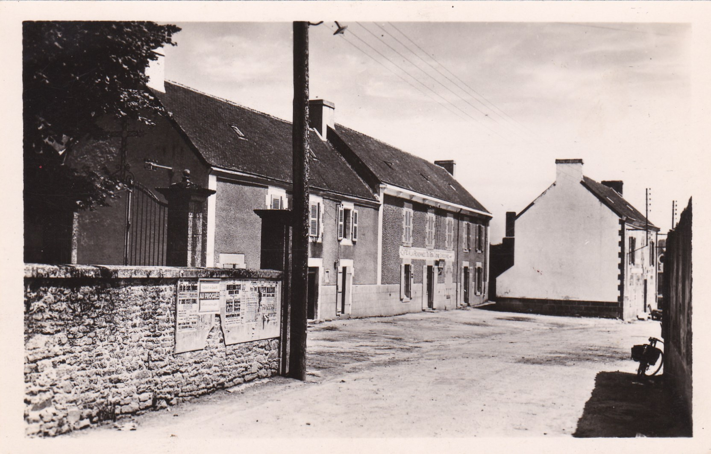
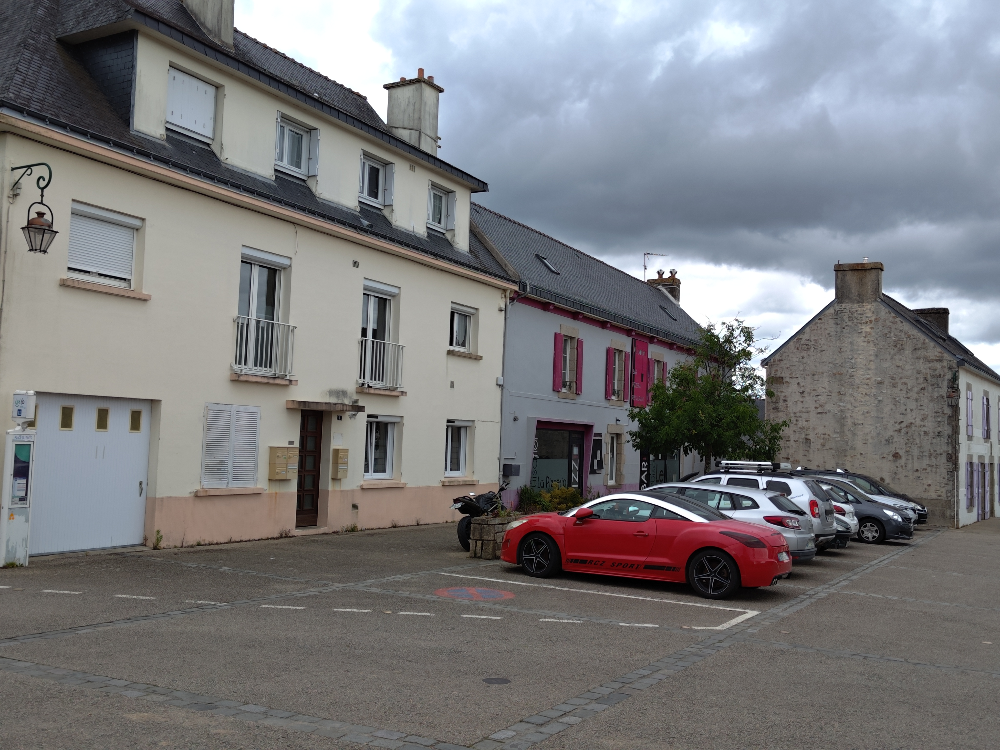

<!--  Copyright (C) 2015-2025 COMITE HISTOIRE ET PATRIMOINE DE CLEGUER / PONT SCORFF -->

# Place du Puits (Cléguer)

On voit au premier plan le mur qui entourait l’église et le presbytère. Au fond, sur la place il y a le Café “A la remontée du bon cidre”, là ou se trouve aujourd’hui le Bar Restaurant Pizzeria Le Puisatier.

*Vers 1900, Carte postale, collection Sylvie Lelgoualc'h*

*En 2024, photo de Pierre-Loup Tristant*

---

Un texte de Pierre-Loup Tristant

Publié sur [la page Facebook du Comité d'Histoire](https://www.facebook.com/comitehistoire56620) le 13 juillet 2024.

Copyright &copy; Comité Histoire et Patrimoine de Cléguer Pont-Scorff
