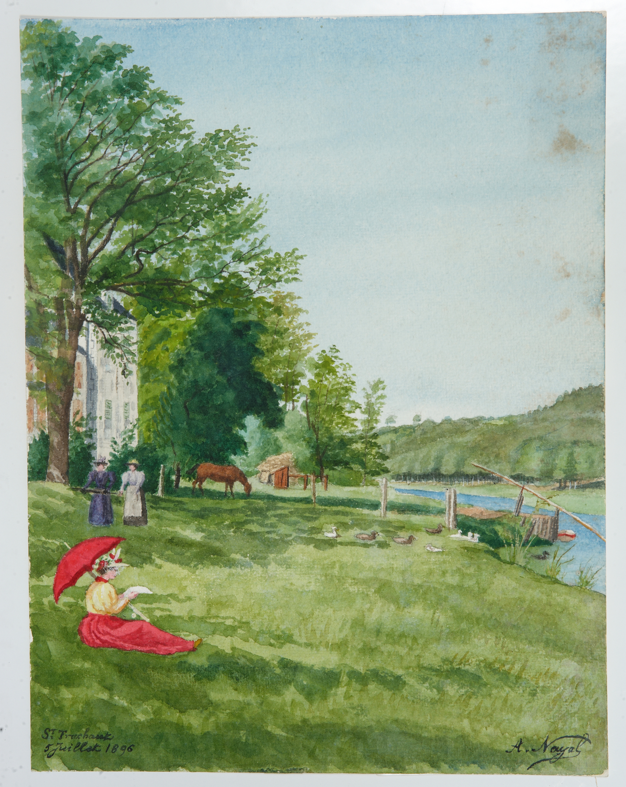
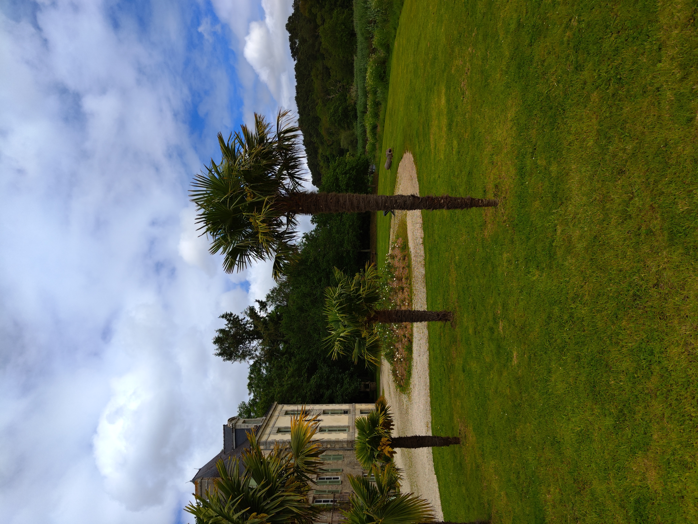

<!--  Copyright (C) 2015-2025 COMITE HISTOIRE ET PATRIMOINE DE CLEGUER / PONT SCORFF -->

# Manoir de Saint-Urchaut (Pont-Scorff)

Sur le tableau, en bas à gauche, on peut lire “Saint-Truchaut, 5 juillet 1896”. En bas à droite, on reconnaît la signature du sculpteur et dessinateur lorientais Auguste Nayel.

*En 1896, Tableau d’Auguste Nayel, collection privée.*

*En 2024, photo de Pierre-Loup Tristant*

---

Un texte de Pierre-Loup Tristant

Publié sur [la page Facebook du Comité d'Histoire](https://www.facebook.com/comitehistoire56620) le 19 juillet 2024.

Copyright &copy; Comité Histoire et Patrimoine de Cléguer Pont-Scorff
