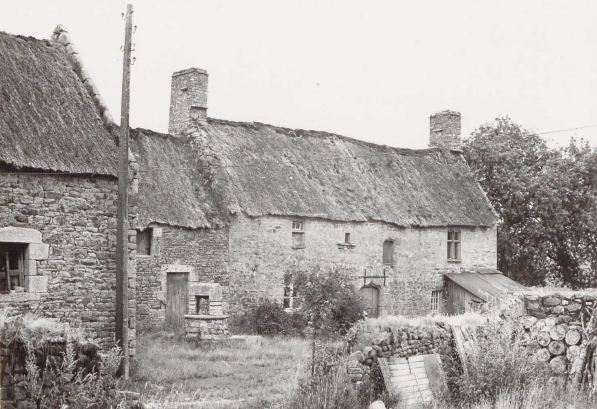
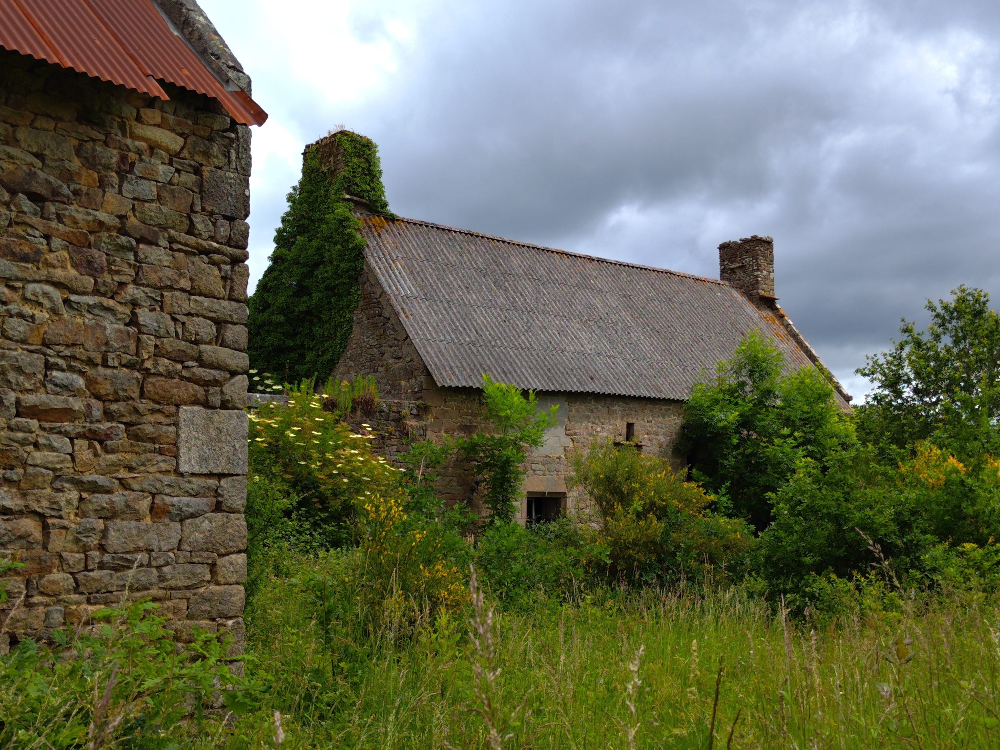

<!--  Copyright (C) 2015-2025 COMITE HISTOIRE ET PATRIMOINE DE CLEGUER / PONT SCORFF -->

# Lann Hir (Pont-Scorff)

Cette bâtisse à toit de chaume pourrait dater du XVIème ou du début du XVIIème. Le village qui se trouve en bordure du site de traitement des déchets est aujourd’hui à l’abandon.

*En 1971, photo des Archives du Morbihan*

*En 2024, photo de Pierre-Loup Tristant*

---

Un texte de Pierre-Loup Tristant

Publié sur [la page Facebook du Comité d'Histoire](https://www.facebook.com/comitehistoire56620) le 26 juillet 2024.

Copyright &copy; Comité Histoire et Patrimoine de Cléguer Pont-Scorff
