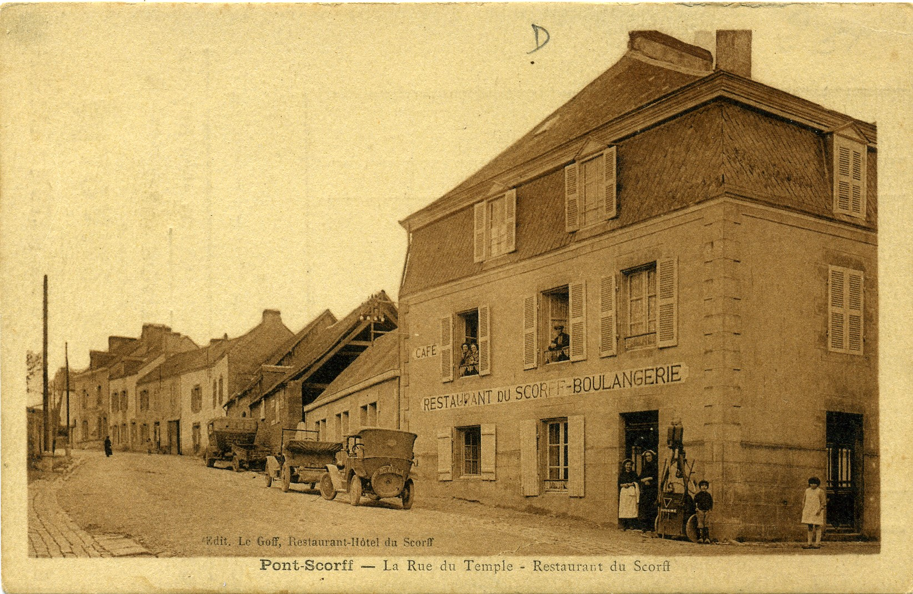
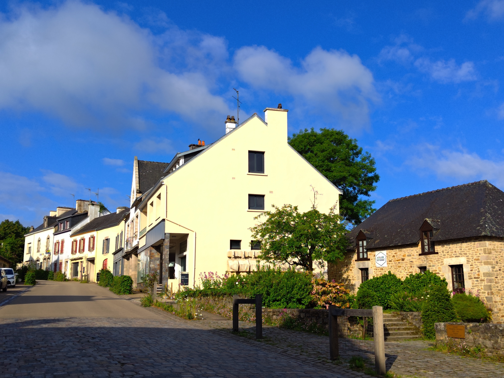

<!--  Copyright (C) 2015-2025 COMITE HISTOIRE ET PATRIMOINE DE CLEGUER / PONT SCORFF -->

# Rue du Temple (Rue du Général de Langle de Cary)

Cette rue s'appelait autrefois la "Rue du Temple”. Sur la carte postale on ne voit pas l’actuel bâtiment de l’Atelier d’Estienne qui est caché par l’Hôtel du Scorff. Ce bâtiment à été détruit vers 1993 au moment où ont commencé les travaux de réhabilitation du bâtiment où se trouve aujourd'hui la galerie d’art.

En haut de la rue on aperçoit les bâtiments où se trouvent actuellement la Boucherie Charcuterie Dorso et un peu plus haut celui de la Biocoop

*Vers 1900, carte postale, collection privée*

*En 2024, photo de Pierre-Loup Tristant*

---

Publié sur [la page Facebook du Comité d'Histoire](https://www.facebook.com/comitehistoire56620) le 2 août 2024.

Copyright &copy; Comité Histoire et Patrimoine de Cléguer Pont-Scorff
