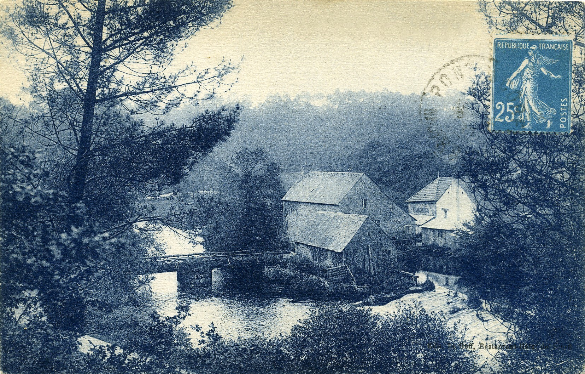
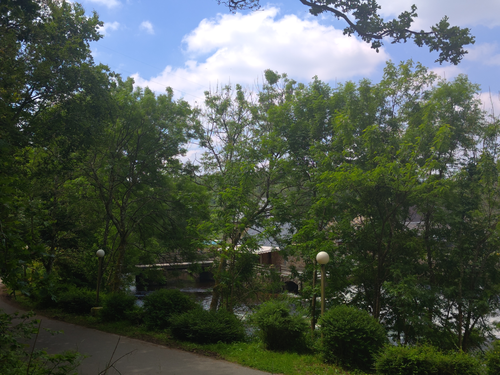
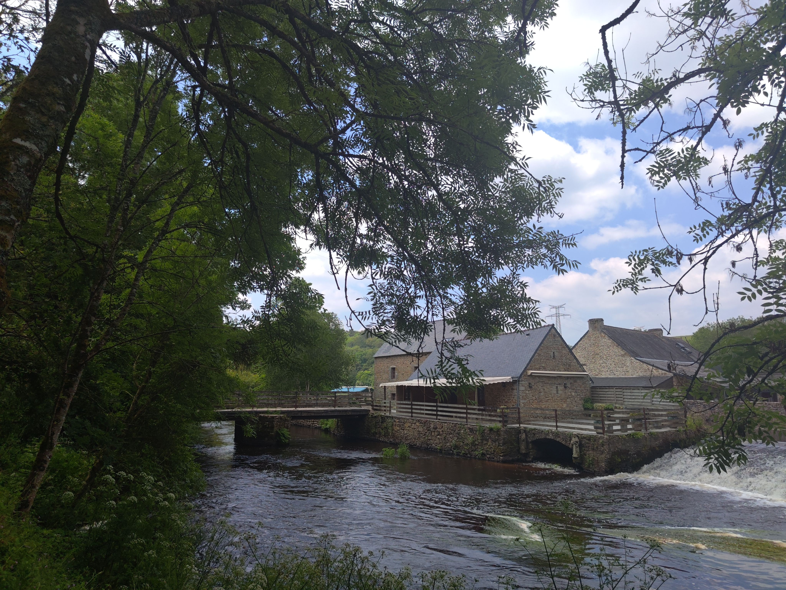

<!--  Copyright (C) 2015-2025 COMITE HISTOIRE ET PATRIMOINE DE CLEGUER / PONT SCORFF -->

# Moulin de Saint Yves

*Vers 1900, carte postale, collection privée*

*En 2024, photos de Pierre-Loup Tristant*

---

Publié sur [la page Facebook du Comité d'Histoire](https://www.facebook.com/comitehistoire56620) le 9 août 2024.

Copyright &copy; Comité Histoire et Patrimoine de Cléguer Pont-Scorff
