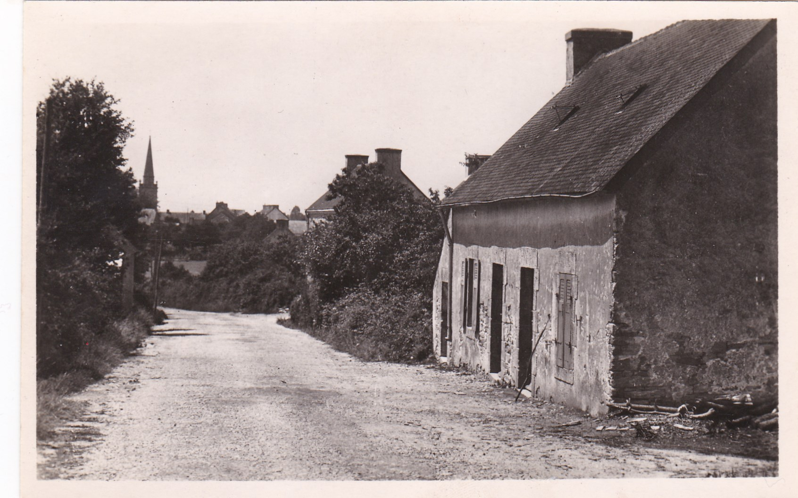
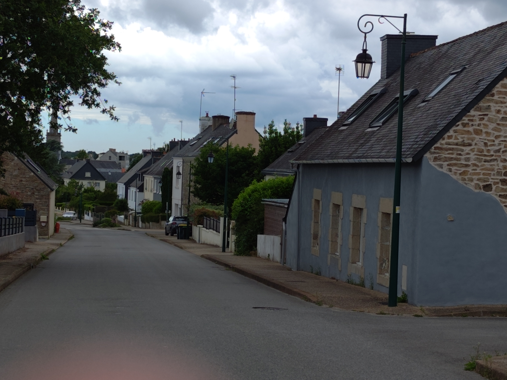

<!--  Copyright (C) 2015-2025 COMITE HISTOIRE ET PATRIMOINE DE CLEGUER / PONT SCORFF -->

# Rue Anne de Bretagne (Cléguer)

La carte postale mentionne le lieu-dit “Lann er Groez Rhu” (Lande de la Croix Rouge).

*Vers 1900, carte postale, collection Sylvie Lelgoualc'h*

*En 2024, photo de Pierre-Loup Tristant*

---

Un texte de Pierre-Loup Tristant

Publié sur [la page Facebook du Comité d'Histoire](https://www.facebook.com/comitehistoire56620) le 16 août 2024.

Copyright &copy; Comité Histoire et Patrimoine de Cléguer Pont-Scorff
