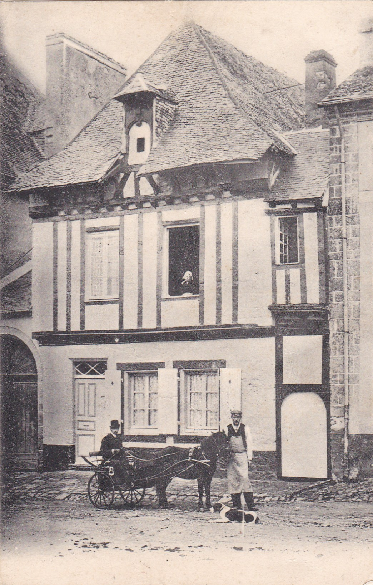
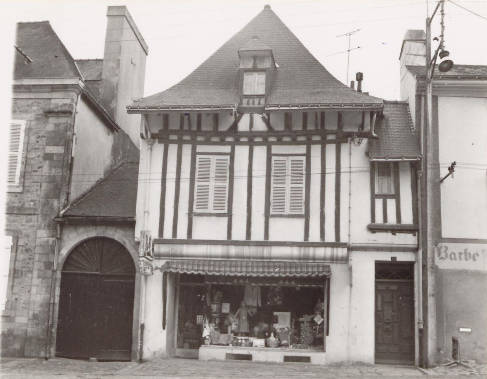
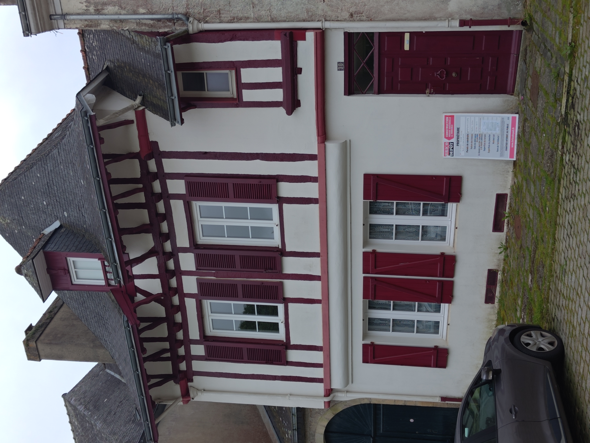

<!--  Copyright (C) 2015-2025 COMITE HISTOIRE ET PATRIMOINE DE CLEGUER / PONT SCORFF -->

# Place de la Maison des Princes (Pont-Scorff)

1 le commerce qui se trouvait au rez-de-chaussée (1958-1985): la boutique de Mme Le Chaton (bazar) s'appelait Au Bouton d'Or. Vous en trouverez quelques photos en commentaire.

*Vers 1900, carte postale, collection Sylvie Lelgoualc'h*

*En 1970, photo de collection privée, famille Le Chaton*

*En 2024, photo de Pierre-Loup Tristant*

---

Un texte de Pierre-Loup Tristant

Publié sur [la page Facebook du Comité d'Histoire](https://www.facebook.com/comitehistoire56620) le 23 août 2024.

Copyright &copy; Comité Histoire et Patrimoine de Cléguer Pont-Scorff
