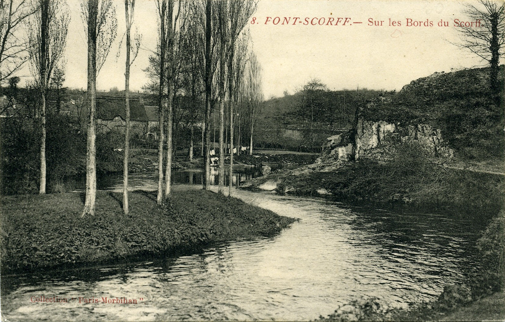
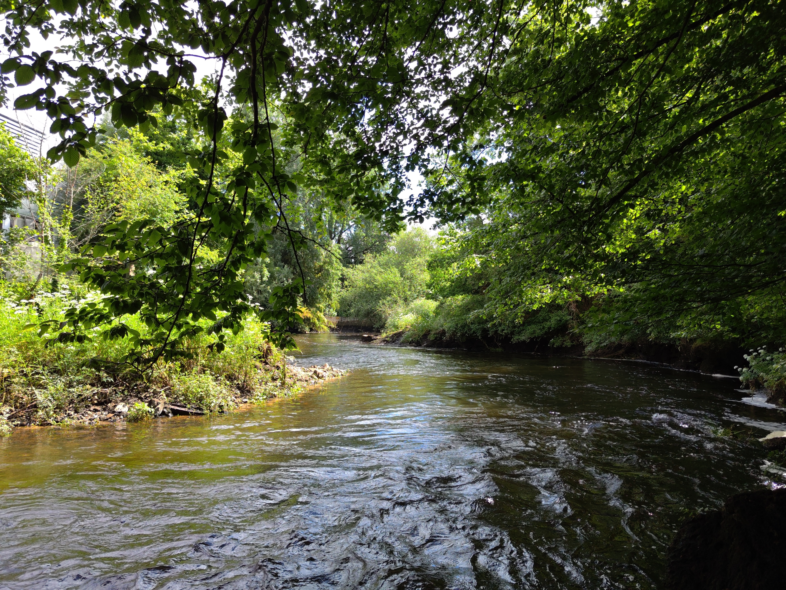

<!--  Copyright (C) 2015-2025 COMITE HISTOIRE ET PATRIMOINE DE CLEGUER / PONT SCORFF -->

# Les bords du Scorff (en contrebas du chemin du Ronce)

On a peine à reconnaître le lieu, tant la végétation s’est développée sur les berges. On reconnaît plusieurs indices sur cette carte postale si on fait bien attention: 

Certains d’entre vous reconnaîtront immédiatement la forme particulière du lit de la rivière avec cet îlot et cette roche qui se trouve côté Pont-Scorff. 

Au fond, la maison au toit de chaume n'existe plus mais elle se trouvait au niveau de l’actuel 10 Rue du Palud. On peut la voir sur une autre carte postale. 
En arrière-plan, derrière la roche, on distingue une palissade, et derrière, un tas de poutres en bois qui étaient stockées sur la cale du Bas Pont-Scorff.

*Vers 1900, carte postale, collection privée*

*En 2024, photo de Pierre-Loup Tristant*

---

Publié sur [la page Facebook du Comité d'Histoire](https://www.facebook.com/comitehistoire56620) le 30 août 2024.

Copyright &copy; Comité Histoire et Patrimoine de Cléguer Pont-Scorff
