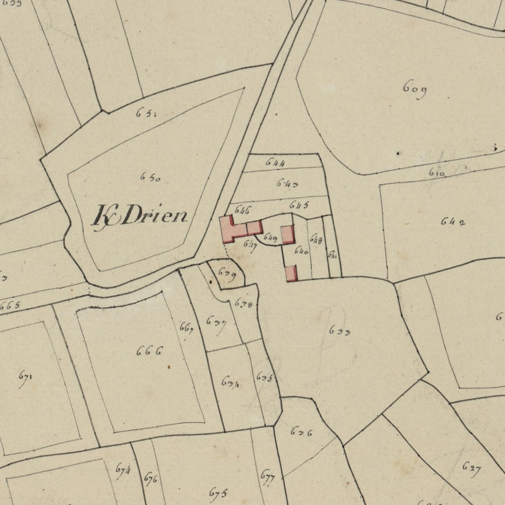

<!--  Copyright (C) 2015-2025 COMITE HISTOIRE ET PATRIMOINE DE CLEGUER / PONT SCORFF -->

# Kerdrien (Pont-Scorff)

Ce village est relativement ancien, sa première graphie connue remonte à 1414 : 

- K/derien 1414
- K/deryen 1426
- K/derian 1449
- Metherie de K/derien 1668
- K/drien 1671,
- Kerdrien sur la carte de Cassini
- K/drien cadastre 1818

Ce toponyme associe Ker au nom de famille Dérien, issu du vieux breton Dergen, cité dans le cartulaire de Redon en 834. Le saint éponyme était compagnon de Saint Neventer, relation que l’on retrouve entre la paroisse de Plouneventer (29) et sa trève de Saint-Derrien.

*Cadastre napoléonien - Section A de Kerlau, 3eme feuille, 1818. Patrimoines & Archives du Morbihan cote 3 P 225 5*

---

Un texte de Michel Pothier. 

Source: « Des sources de l’Ellé à l’Île de Groix », Jean-Yves Plourin et Pierre Hollocou, édition Emgleo Breiz, 2014.

Publié sur [la page Facebook du Comité d'Histoire](https://www.facebook.com/comitehistoire56620) le 4 octobre 2024.

Copyright &copy; Comité Histoire et Patrimoine de Cléguer Pont-Scorff
