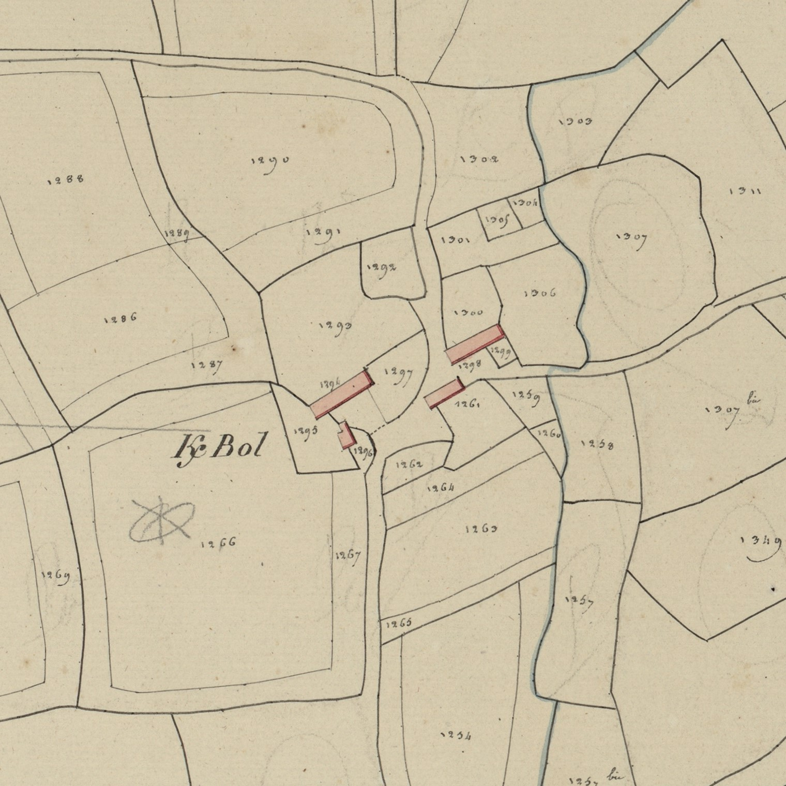

<!--  Copyright (C) 2015-2025 COMITE HISTOIRE ET PATRIMOINE DE CLEGUER / PONT SCORFF -->

# Kerbaul (Pont-Scorff)

- K/paul 1508
- K/paoul 1559
- K/baol 1593
- K/bolle 1730
- K/baul et K/bol 1772, (Cassini : Kerbole) 
- K/bol cadastre de 1818.

Ce toponyme associe ker, village, au patronyme Paul, prononcé Paoul en breton. Paul Arélien, fondateur de l’évêché du Leon était un disciple d’Ildut au Pays de Galles.

*Cadastre napoléonien - Section A de Kerlau, 3eme feuille, 1818. Patrimoines & Archives du Morbihan cote 3 P 225 5*

---

Un texte de Michel Pothier. 

Source: « Des sources de l’Ellé à l’Île de Groix », Jean-Yves Plourin et Pierre Holloco, édition Emgleo Breiz, 2014.

Publié sur [la page Facebook du Comité d'Histoire](https://www.facebook.com/comitehistoire56620) le 18 octobre 2024.

Copyright &copy; Comité Histoire et Patrimoine de Cléguer Pont-Scorff
