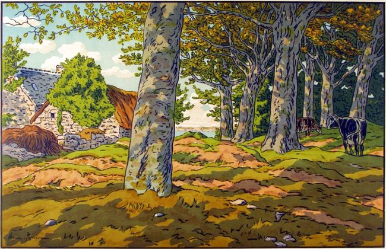

<!--  Copyright (C) 2015-2025 COMITE HISTOIRE ET PATRIMOINE DE CLEGUER / PONT SCORFF -->

# Le bail à convenant (Domaine congéable)

C'est un type de bail, très fréquent en Basse Bretagne jusqu’au XIXe siècle. Une convention par laquelle un propriétaire, généralement un seigneur, vend les édifices à un preneur (domanier) et lui cède, moyennant une rente annuelle et une commission, la jouissance du fond de la tenue (terre concédée à un vassal ou à un tenancier non noble par un seigneur) :

Le propriétaire qualifié de « foncier » ou « bailleur » possède les terres ainsi que les arbres nobles (hêtres, chênes …),

Le domanier (ou convenancier ou colon) est propriétaire des édifices et superficies qu’il a achetés au bailleur (bâtiments, fossés et talus ainsi que les arbres appartenant aux espèces non nobles). 

Le bailleur, propriétaire du fond, a le droit de congédier le domanier en lui remboursant la valeur des édifices et des superficies. Les modifications sur les édifices ou les nouvelles constructions (granges, hangars…) n’étaient pas bien acceptées par le bailleur. En effet, il fallait obtenir son autorisation pour effectuer les moindres travaux sur les constructions sauf ceux nécessaires à l’entretien courant. Une modification apportée créait une plus-value au moment du rachat. C’est pour cette raison qu’il accordait rarement cette autorisation.

Ce contrat n’était pas très populaire. Pour certains, il était responsable du retard pris en Bretagne par l’agriculture. En effet, il maintenait les paysans dans un immobilisme car ils ne pouvaient rien modifier dans les bâtiments sans l’autorisation du propriétaire foncier. En 1789, lors de la convocation des Etats Généraux, chaque paroisse est conviée à établir un cahier de doléances. Celles-ci portent bien souvent sur l’usage du domaine congéable. En voici quelques exemples tirés du livre de Jean Savina– Quimperlé et ses environs autrefois – Imprimerie du Télégramme – Brest 1967. 

« – Pour encourager les laboureurs dans leurs travaux, demander la suppression des usements qui mettent des entraves à l’agriculture, tels sont les domaines congéables qui font la richesse du propriétaire foncier et très souvent la ruine du malheureux colon. […] Tous ces différents inconvénients proviennent de la nature du domaine congéable qui ne permet pas au colon de donner à leurs maisons les ouvertures nécessaires ni de se procurer sur leur rue à batterie des granges propres à mettre leurs blés à l’abri. Les seigneurs s’y opposent dans la crainte de grever leur fonds ou ne l’accordent qu’à titre onéreux, soit à la charge d’augmenter la rente ou d’une plus forte commission. »

« - A être autorisés à abattre les bois fonciers de leurs terres nécessaires pour y faire des réparations urgentes et indispensables et pour construire les charrettes, charrues et autres instruments de labour nécessaires dans un ménage. »

« - Que chaque particulier ait la liberté de faire bâtir tant et tels édifices qu’il voudra ou pourra construire à sa commodité. (Il était interdit au domanier de construire de nouveaux édifices, car le seigneur foncier ne voulait pas laisser « grever le fonds ».

Quand un bâtiment tombait en ruine, le domanier pouvait le réédifier, mais dans les mêmes dimensions et avec des matériaux de même nature. C’est pour maintenir sans conteste son droit à une réédification éventuelle que le paysan se faisait conservateur des ruines de son village. Toujours du moins, il en respectait les fondations, quitte à en transformer le sol intérieur en minuscule courtil.)

Cette pratique, bien que contestée à la révolution, fut confirmée par la loi du 6 août 1791. Elle est supprimée le 26 août 1792 puis rétablie par la loi du 9 brumaire an VI (Oct-Nov 1797).

*Le bois de hêtres à Kerzardern, estampe, Henri RIVIERE, 1917. Musée Départemental Breton Cote 2002.24.2.*

---

Un texte de Michel Pothier. 

Publié sur [la page Facebook du Comité d'Histoire](https://www.facebook.com/comitehistoire56620) le 20 octobre 2024.

Copyright &copy; Comité Histoire et Patrimoine de Cléguer Pont-Scorff
