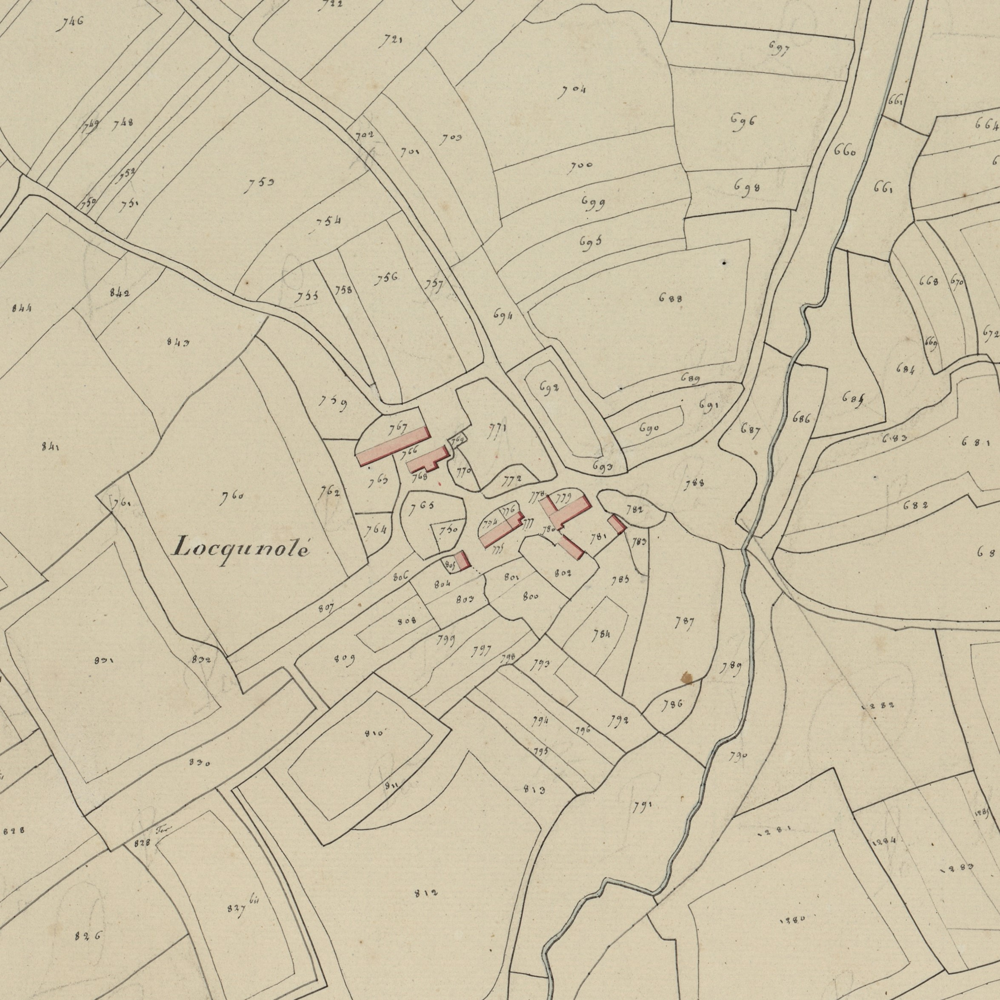

<!--  Copyright (C) 2015-2025 COMITE HISTOIRE ET PATRIMOINE DE CLEGUER / PONT SCORFF -->

# Nocunolé (Pont-Scorff)

Locunolé est un toponyme très répandu en Bretagne, mais à Pont-Scorff il s'écrit un peu différemment : Nocunolé.

Sa première graphie relevée dans des documents anciens est  Locguennolay 1508. Puis on trouve :
- Locguenholay 1540
- Locguenolle 1560
- Locguenollay 1594
- Locunolay 1683
- Nocunolay 1689
- Locunolé et. Nocunolay 1762, (Cassini : Locunolé)
- Nocunolé 1790
- Locquenolé cadastre 1818

Il associe Loc au patronyme Guenolay (Saint Guenolé, abbé fondateur de l’Abbaye de Landévennec). Au XVIIe siècle, une mauvaise interprétation du L initial, pris pour l’article français, a conduit à lui substituer un N, pour l’article breton an.

*Cadastre napoléonien - Section A de Kerlau, 3eme feuille, 1818. Patrimoines & Archives du Morbihan cote 3 P 225 5*

---

Un texte de Michel Pothier. 

Source: « Des sources de l’Ellé à l’Île de Groix », Jean-Yves Plourin et Pierre Hollocou, édition Emgleo Breiz, 2014.

Publié sur [la page Facebook du Comité d'Histoire](https://www.facebook.com/comitehistoire56620) le 25 octobre 2024.

Copyright &copy; Comité Histoire et Patrimoine de Cléguer Pont-Scorff
