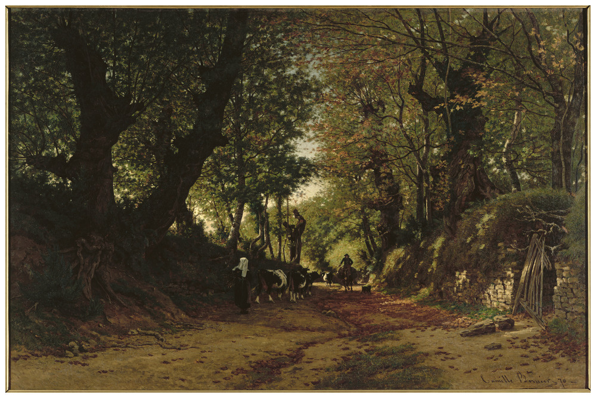

<!--  Copyright (C) 2015-2025 COMITE HISTOIRE ET PATRIMOINE DE CLEGUER / PONT SCORFF -->

# L'affaire de Pont-Scave - Gervais Gragnic

Le 15 août 1787, au village Kermorgant à Pont-Scorff, il est 10h du soir quand Gervais Gragnic est réveillé par des voix qui lui supplient d’ouvrir la porte.

“Lorsque je me réveille, j'entends plusieurs voix qui crient et qui me supplient de leur prêter secours.

J’allume la chandelle et j’ouvre la porte pour découvrir 6 visages familiers : Anne Guegen, Etiennette Guegen et Alexis Coeffic du village de Nocunolé, ainsi que Joseph Coeffic, Hélène Falquero et Marie le Limantour du village du Kergelavan. Je comprends qu’il y a eu quelque chose de grave et accepte de les suivre dans la nuit.

Nous descendons le chemin creux qui mène vers la route de Lorient et, à l'entrée du champ de Lann Bihan, je découvre Louis Coeffic qui baigne dans son sang. Il respire encore mais il est gravement blessé à la tête et au visage. Nous tentons tant bien que mal de le transporter à ma maison à Kermorgant car c’est la plus proche. Il a besoin de soins d’urgence car il ne faut qu’il se vide de son sang.

Arrivés à la maison, nous lui retirons veste, chapeau et chaussures avant de l'allonger sur une paillasse. Avec des bouts de tissus et un mouchoir qu’on a trouvé dans la poche de sa veste, nous tentons de faire un bandage rudimentaire pour essayer d'éponger le sang qui coule abondamment de sa tête. Une des plaies est si profonde qu’on entrevoit une partie de son cerveau.

Je reste auprès de Louis pendant la nuit. Il est inconscient, sauf de temps en temps où on l'entend dire “hola”.

Le lendemain matin, c’est sa femme Henriette qui frappe à la porte. Elle a été avertie de l’incident et vient au chevet de son mari.

Vers deux heures de l'après- midi, le 16 août, Louis succombe à ses blessures.”

*Un chemin près de Bannalec, peinture, Camille BERNIER, 1870. Musée d'arts de Nantes*

---

Un texte de Pierre-Loup Tristant

Source: procès verbaux trouvés et retranscrits par Eric Le Guennec.

Publié sur [la page Facebook du Comité d'Histoire](https://www.facebook.com/comitehistoire56620) le 3 novembre 2024.

Copyright &copy; Comité Histoire et Patrimoine de Cléguer Pont-Scorff
