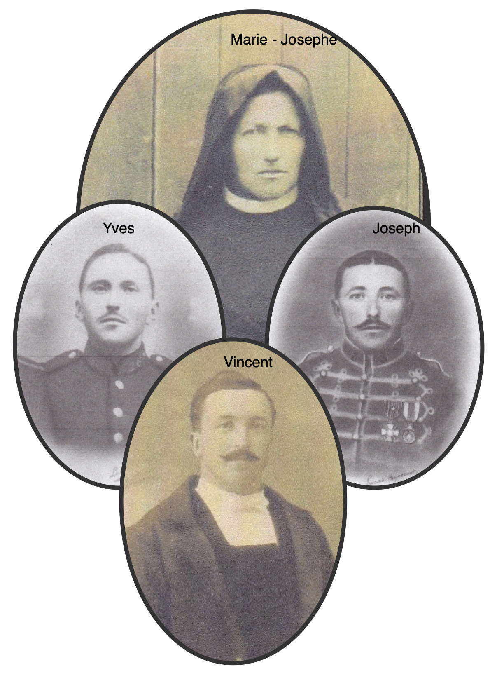

<!--  Copyright (C) 2015-2025 COMITE HISTOIRE ET PATRIMOINE DE CLEGUER / PONT SCORFF -->

# Marie Josèphe Gragnic, une mère dans la Grande Guerre

"Une vague de froid s’est emparée du pays en ce mois de janvier 1917 et je grelotte dans ma tenue de grand deuil quand j’ouvre la porte de ma ferme du hameau de Kernaude. C'est monsieur le maire de Cléguer, Jean Marie Adol, pour la deuxième fois...
Je sais ce qu’il annonce et mon cœur me fait mal. L’année dernière il était déjà venu avec ce maudit papier m’annoncer que Yves, mon cher fils de 20 ans, s’était battu. Et aujourd’hui c’est au tour de Joseph, mon courageux Joseph qui n’avait que 25 ans.
Heureusement il me reste mon Vincent, mon tendre aîné, revenu vivant du front mais le corps et l’esprit abîmés à jamais. Lui si gai autrefois. Quelle épreuve pour une mère.

Vincent a 28 ans quand il reçoit cet éclat d’obus dans le bras droit. C’est en Belgique à Maissin lors
de la toute première offensive en aout 1914 qu’il est touché. Aucune opération n'est possible,
aucun appareillage non plus. Il est réformé définitif. Dans ses cartes postales, envoyées depuis
Paris où il est soigné il demande des nouvelles de ses frères. Lorsqu'il revient en aout 1915, il
retrouve sa femme Françoise et sa fille Thérèse ainsi que son poste de secrétaire de mairie et de
crieur à Cléguer. On reconnait bien son écriture sur les actes d'état civil, il doit composer avec son
infirmité et écrire de la main gauche.

J'ai reçu des lettres et des visites des camarades de mes fils qui m'ont expliqué leurs vies là-bas sur
le front. J'ai tout noté pour ne rien oublier.
Yves participe à la bataille de la Somme du 1er juillet au 18 novembre 1916 aux côtés des
Britanniques et de ces toutes nouvelles machines métalliques, les premiers chars d’assaut.
L'enfer pour lui, c'est cette pluie incessante qui tombe en octobre. Le champ de bataille est un
bourbier, la pluie est glaciale, neige et blizzard mettent en échec les offensives. Il n'y a pas de
tranchée à Sailly Saillisel pas d'abris pour se protéger. Yves, sur la ligne de front, saute d'un trou
d'obus à moitié rempli d'eau à un autre trou d'obus. Il est trempé. Le marmitage continue, des
camarades sont atteints, d’autres sont ensevelis sous la terre lors des explosions d'autres encore
restent prostrés. Dans les ruines de ce village et autour ce n'est qu'un immense étang de boue.
Il parait qu'on compte plus de 1400 morts français par jour ! Et pourtant aucun des objectifs fixés
par les autorités n'est atteint.
C'est une des tragédies les plus sanglantes de la Somme, la moitié des soldats disparaissent. Il n'y a
ni vainqueur ni vaincu. Le Général Joffre, devant cet échec, renonce à l'offensive.

Alors le sacrifice de mon fils, pour qui, pour quoi ?
C'est à 14h, le 28 octobre 1916 qu'Yves perdra la vie dans cette mer de boue.

Maintenant, je regarde la photo de Joseph, il a belle allure mon garçon dans son uniforme du
3ème régiment de hussard. Sur son cheval, il effectue des missions de reconnaissance. Le Colonel
Lyautey assure le commandement. Je m'étais inquiétée quand il avait été blessé à la jambe par un
coup de sabot, si j'avais su ce qui l'attendait...

Son régiment parcourt plusieurs fois la région frontalière entre les Flandres et la Belgique. Puis il
doit se replier sur la Somme puis l’Oise. Les Allemands sont sur les crêtes, ils ont l'avantage. C'est
alors que la guerre change, on n'a plus besoin des cavaliers ni des chevaux. Et puis, il y en a déjà
tellement qui sont morts. Son régiment devient le régiment de cuirassiers à pied. Il doit
s'enterrer dans les tranchées. L'hiver 1916-1917 est le plus froid de toute la guerre, les boules de
pain noir, pour le ravitaillement, arrivent gelées. Les soldats ne se reposent pas, ne se déshabillent
pas. Parfois en cas de bombardement la nourriture n'est pas livrée et ils peuvent rester plusieurs
jours sans manger. Quand elle arrive, la boue et la terre se mélangent à leurs aliments. La vie dans
les tranchées est un enfer. Joseph découvre la boue gluante, les marches harassantes sur les
chemins défoncés, les rats, les poux de corps. Et puis, il y a ce 20 janvier 1917 à Choisy Au Bac
entre Paris et Amiens. Ce jour là, 2 blessés par éclats de mines sont inscrits sur le journal de bord
du régiment et il y a un tué, Joseph Marie GRAGNIC, mon fils.

J'accroche les portraits de mes 2 garçons « morts pour la France » à la place d'honneur entre les
lits clos dans la pièce commune de la ferme de Kernaude. Ce sont mes héros, mes fils chéris.

*Marie-Josèphe Gragnic et ses fils, Collection Famille Gragnic* 

---

Un texte de Sylvie Lelgoualc'h.

Lu par Sylvie Lelgoualc'h lors des comémorations du 11 novembre 2025 à Cléguer.

Publié sur [la page Facebook du Comité d'Histoire](https://www.facebook.com/comitehistoire56620) le 11 novembre 2024.

Copyright &copy; Comité Histoire et Patrimoine de Cléguer Pont-Scorff
