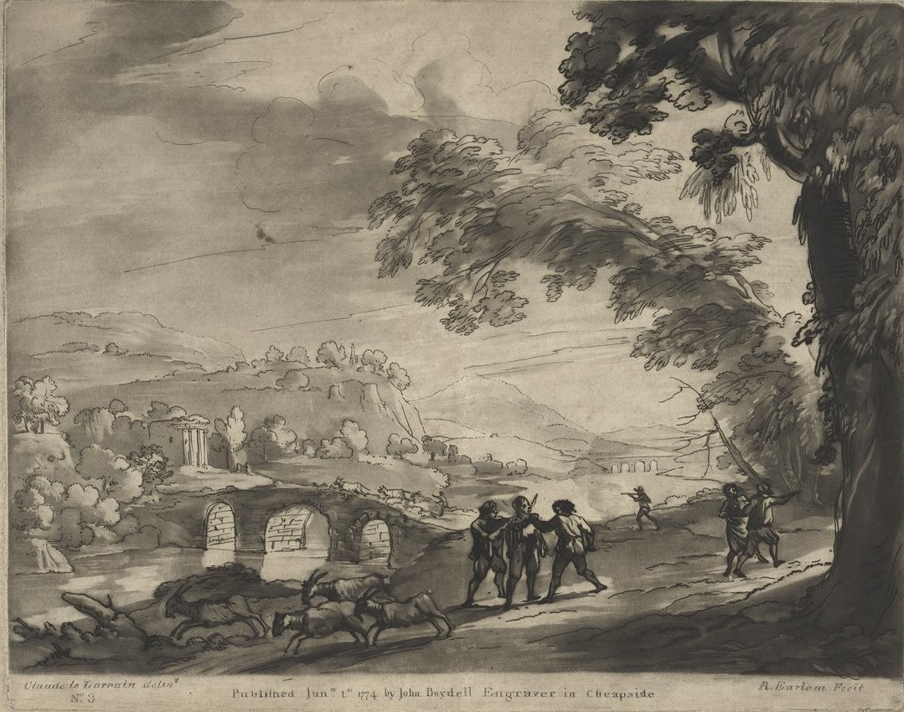

<!--  Copyright (C) 2015-2025 COMITE HISTOIRE ET PATRIMOINE DE CLEGUER / PONT SCORFF -->

# L'affaire de Pont-Scave - Louis Coeffic

Le 15 août 1787, Louis Coeffic du village de Penmané rentre du pardon de Notre Dame de Bonsecours à Queven. Il est en compagnie de Corentin Le Gueldre du village de Kergelavant et de quelques autres paroissiens de Lesbin (actuelle commune de Pont-Scorff).

“Il est temps de rentrer car le soleil est déjà passé à l’horizon et il fera bientôt nuit noire. Nous sortons de la grande route après Pont-Scorff afin de prendre le chemin creux qui monte vers Kermorgant. Je suis avec Corentin derriére le groupe et je distingue dans l’entré du champs de Lann Bihan 4 hommes habillés de blanc.

Quand nous arrivons à leur hauteur, ils nous demandent, en français, si c’est bien la route de Pont-Scorff. On dirait bien que ce sont des Lorientais qui se sont perdus. Corentin leur répond, en breton, qu’ils tiennent le bon chemin et au passage, en se moquant un peu d’eux. Soudainement, un des Lorientais l’attrape par le col et lui ordonne de les conduire jusqu'à Pont-Scorff. Corentin refuse et il répond, toujours en breton, que ce n’est pas sa route. Pris de colère, le Lorientais sort un sabre et lui porte un coup à la tête. Le reste du groupe, part en courant, mais moi, je ne veux pas laisser mon ami seul.

Les 3 autres gars sortent à leur tour leur sabre et se dirigent vers moi.”

*Paysage avec des bandits, auteur Claude Lorrain, graveur Richard Earlom, BnF - Bibliothèque nationale de France Gallica, cote ark:/12148/cb45920647f*

---

Un texte de Pierre-Loup Tristant

Source: procès verbaux trouvés et retranscrits par Eric Le Guennec.

Publié sur [la page Facebook du Comité d'Histoire](https://www.facebook.com/comitehistoire56620) le 17 novembre 2024.

Copyright &copy; Comité Histoire et Patrimoine de Cléguer Pont-Scorff
