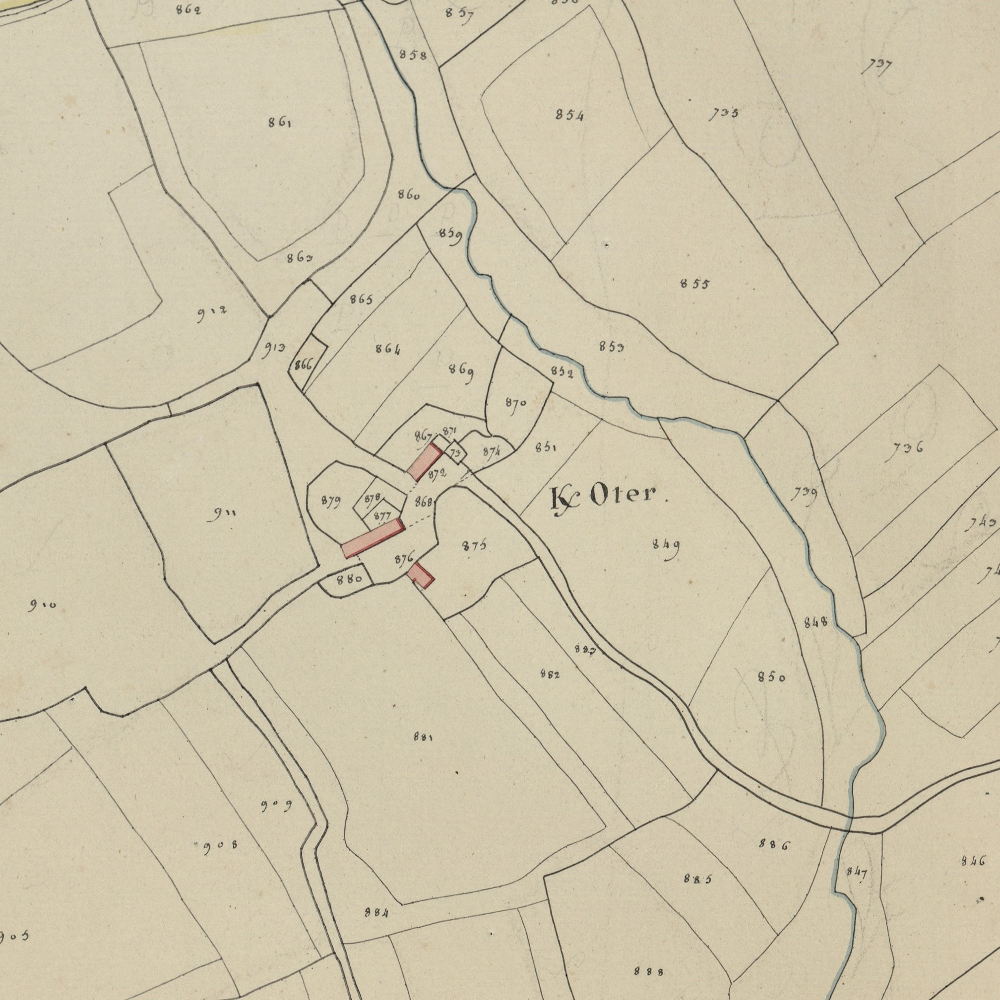

<!--  Copyright (C) 2015-2025 COMITE HISTOIRE ET PATRIMOINE DE CLEGUER / PONT SCORFF -->

# Keroter (Pont-Scorff)

Voici quelques graphies anciennes relevées dans divers documents :

- K/auter 1540
- K/aulter 1561
- K/oter 1701
- Métairie de K/auter 1754
- K/otter 1771
- K/oter et Pont K/oter cadastre de 1818.

Malgré l’absence de formes plus anciennes, on peut voir dans ce toponyme l’association de Ker et du nom de personne Gautier, Gauter ou Gaultier.

*Cadastre napoléonien - Section A de Kerlau, 3ème feuille, 1818. Patrimoines & Archives du Morbihan cote 3 P 225 5*

---

Un texte de Michel Pothier. 

Source: « Des sources de l’Ellé à l’Île de Groix », Jean-Yves Plourin et Pierre Holloco, édition Emgleo Breiz, 2014.

Publié sur [la page Facebook du Comité d'Histoire](https://www.facebook.com/comitehistoire56620) le 18 novembre 2024.

Copyright &copy; Comité Histoire et Patrimoine de Cléguer Pont-Scorff
