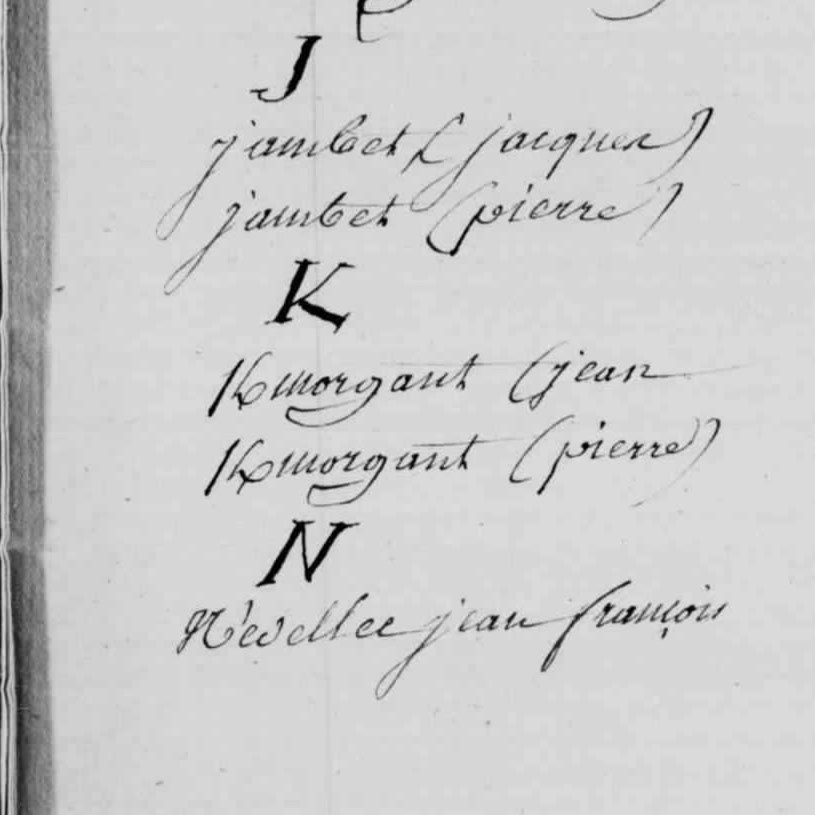
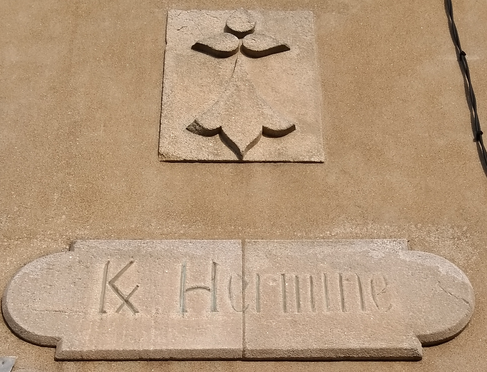

<!--  Copyright (C) 2015-2025 COMITE HISTOIRE ET PATRIMOINE DE CLEGUER / PONT SCORFF -->

# L'histoire de la lettre K barré (Ꝃ)

K barré et, de façon non ambiguë, k barré diagonalement, est une lettre latine supplémentaire utilisée en latin médiéval et en breton. Elle est formée d'un K diacrité par une barre inscrite au travers en diagonale.

Il s’agit d’une lettre de l’alphabet breton aujourd’hui oubliée « un signe diacritique. C’est une lettre de l’alphabet français sur laquelle il y a un signe ajouté, à savoir une barre sur le jambage. Avant 1900, ce “K barré” était utilisé pour orthographier les noms commençant par Ker dans les registres de naissance, mariage, décès ou baptême.»

Même chose pour les nombreux lieux-dits débutant par Ker : Kermeur, Kerdual, Kerbihan… Sur les anciens fonds de carte, les K barrés étaient légion. « Il faut rappeler que ker vient de “caer” qui, en vieux breton, désignait un endroit fortifié puis, à partir du 10e siècle, un hameau et tout regroupement de maisons. C’est à partir de là qu’on a vu une prolifération des localités avec ce préfixe dans toute la Basse-Bretagne. »

*Registre baptêmes mariages sépultures, paroisse de Lesbin Pont-Scorff, 1783-1792, Archives du Morbihan, cote 179_1MIEC179_R5_01-0001*

Découvrez aujourd’hui la suite de la surprenante histoire de la lettre Ꝃ (K/), emblème de l’identité bretonne et finalement proscrite par la France.

A la fin du 19e siècle, “l’usage quotidien”du Ꝃ va être attaqué par l’administration française. « En 1895, un arrêt du Conseil d’État va ordonner l’interdiction du K barré »
On rapporte que le K barré fut interdit dans les communications officielles par le ministre de la marine dès 1881 afin d’éviter que la confusion ne se répande dans les rapports et archives, freinant ainsi le bon fonctionnement des opérations.

« Une prohibition rappelée en 1955 par une instruction générale relative à l’état civil pour qui ce signe constitue une “altération manifeste de l’orthographe”. On estimait également que cela pouvait poser des problèmes de lecture. En dehors de la Bretagne, il y avait un risque que les noms soient mal prononcés. Si votre nom était écrit Ꝃros, on pouvait vous appeler “Kros” au lieu de “Kerros”. C’est ce qu’on appelle un orthographisme : prononcer un mot tel qu’il est écrit. »

Si le Ꝃ va alors disparaître des documents officiels, il va néanmoins muter. « Pour certains noms, la barre va “glisser” entre le K et la deuxième lettre. Elle va se transformer en un slash ou en une apostrophe. Des formes qui vont résister, grâce aux Bretons et Bretonnes expatriées notamment. ». Ce caractère a perduré notamment à la Réunion et à Maurice.

Ainsi, Gustave K/vern (prononcer Kervern), l’acteur bien connu pour sa participation à l’émission "Groland" et ses rôles au cinéma, est Mauricien de naissance, descendant d’un marin breton qui a embarqué à Brest en 1774 pour s’établir à l’île Maurice. Lorsqu’il a souhaité acquérir la nationalité française, il a tenu, non sans difficulté, à garder l’orthographe mauricienne en insérant un slash entre le K et le v.

Actuellement, une députée de la Réunion, Émeline K/bidi (prononcer Kerbidi), siège à l’assemblée nationale et son nom est également orthographié avec un slash.

*Inscription en breton sur la façade d'une maison à Quimiac (Loire-Atlantique, France) par Skimel sous licence CC BY-SA 4.0*

---

Un texte de Joël Nevannen

Source: Yann Riou « Le K barré, d’hier à aujourd’hui» Istorioù Skritur - 1992

Publié sur [la page Facebook du Comité d'Histoire](https://www.facebook.com/comitehistoire56620) les 1er et 8 décembre 2024.

Copyright &copy; Comité Histoire et Patrimoine de Cléguer Pont-Scorff
