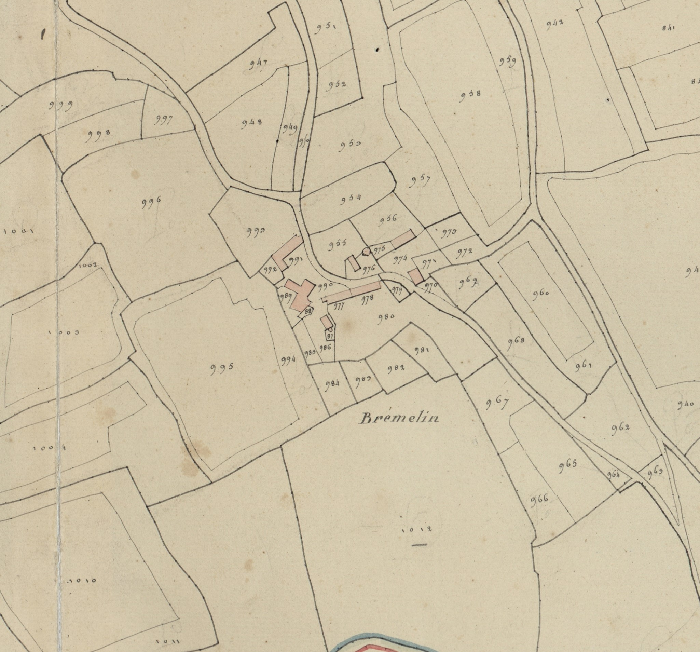
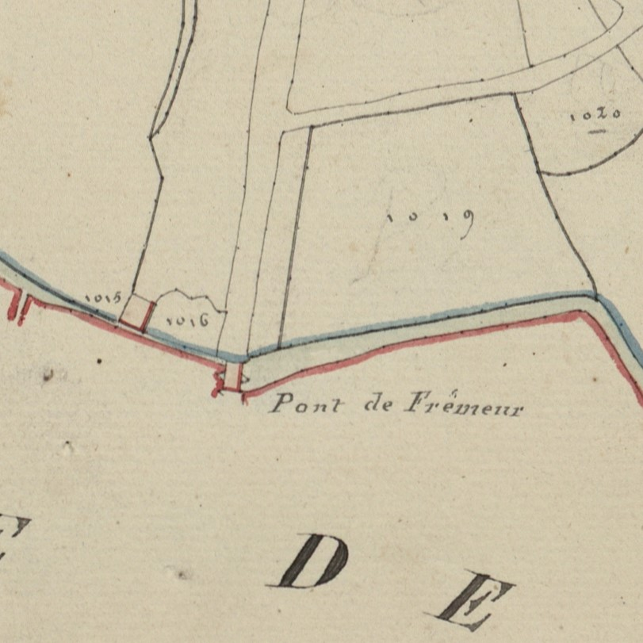

<!--  Copyright (C) 2015-2025 COMITE HISTOIRE ET PATRIMOINE DE CLEGUER / PONT SCORFF -->

# Bremelin

Dans les documents anciens deux noms désignent le même village, ceux sont Bremelin et Fremeur.

Les graphies relevées sont les suivantes :

- Bremelin 1426, 1496, 1559, 1640, 1683, 1701, 1762, 1790
- K/bremelyn 1508
- Bremellin 1669
- Bremellin 1671
- Bresmelin 1771
- Bremelin cadastre de 1818.

- Lieu noble de Fremeur 1683
- Moulin de Fremeur 1683, 
- Moulin Fremeur 1689
- Moulin de Fremeur et Pont du Fremeur cadastre de 1818

Ce village est situé sur un sommet qui domine la vallée du Scave. Le toponyme associe “bre”, “bren” (sommet) et le nom de personne Melin. Ce nom de famille, Moulin en français, est très répandu dans la paroisse de Lesbin au XVIe siècle. 
Le nom du lieu noble de Fremeur, possédé par Michel Gaschet, seigneur de Brémelin en 1683 et le moulin de Fremeur, semble indiquer que le Scave ait pu porter aussi à cet endroit ce nom, issu de frout (cours d’eau rapide), devenant fret puis fre et meur (grand).

*Cadastre napoléonien - Section D de Kermorvant, 2ème feuille, 1818. Patrimoines & Archives du Morbihan cote 3 P 225 12*

---

Un texte de Michel Pothier. 

Source: « Des sources de l’Ellé à l’Île de Groix », Jean-Yves Plourin et Pierre Holloco, édition Emgleo Breiz, 2014.

Publié sur [la page Facebook du Comité d'Histoire](https://www.facebook.com/comitehistoire56620) le 13 décembre 2024.

Copyright &copy; Comité Histoire et Patrimoine de Cléguer Pont-Scorff
