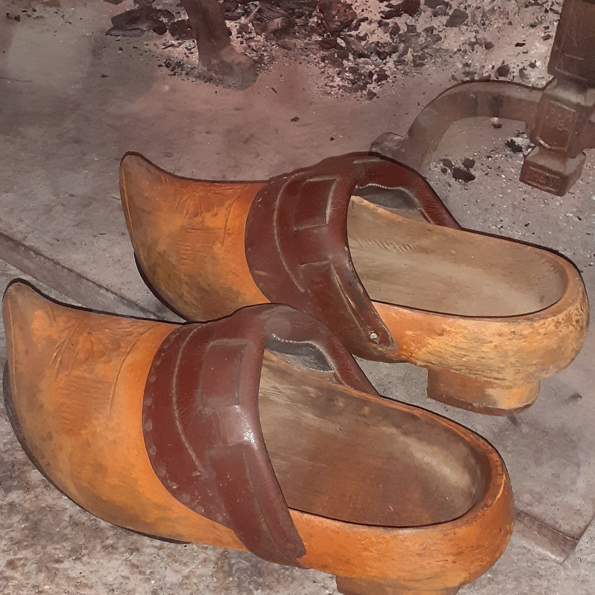

<!--  Copyright (C) 2015-2025 COMITE HISTOIRE ET PATRIMOINE DE CLEGUER / PONT SCORFF -->

# Noël en 1950 à Pont-Scorff

Mamylou raconte à sa petite fille :

- Mamylou raconte moi ton Noël quand tu étais petite ! Dans l'ancien temps !
- Oh il n'y a pas grand chose à raconter, ce n'était pas du tout comme aujourd'hui, dans ma famille. C'était surtout une fête religieuse, la naissance du Petit Jésus.
- Mais comment préparais tu cette fête ?
- Pour moi c'était la journée de cirage des chaussures. Elles devaient être bien brillantes pour les 3 messes du 24 décembre. Je passais la brosse avec le cirage puis le chiffon ensuite. Mon frère jumeau n'avait pas cela à faire, c'est un garçon ! La première messe était à 23h30. Nous quittions notre ferme de Mané-Guennec, tous en famille et rejoignons à pied, par tous les temps, l'église paroissiale au centre de Pont-Scorff. Les 3 messes se suivaient et nous rentrions vers 1 h du matin. Là, maman nous servait un chocolat chaud avec une tranche de brioche ! La fête !
- Et le père Noêl pour toi ?
- Oh il ne fallait pas parler du père Noêl dans mon école Notre-Dame-du-Rosaire ! C'était très mal vu ! Je rappelle que c'est une fête religieuse.
- Où trouvais tu tes cadeaux? Dans tes souliers aux pieds du sapin ? 
- Mais il n'y avait pas de sapin, pas de crèche ni de décoration chez nous ! Mon frère et  moi on mettait bien nos sabots devant la cheminée mais le jour de Noêl ils étaient toujours vides. Quand nous demandions à nos parents, qui nous laissaient les déposer, pourquoi ? Ils nous répondaient que nous étions trop loin de la ville et que le père Noël, enfin non le Petit Jésus, ne pouvait pas passer chez nous. C'est vrai nos petits camarades dans les autres fermes n'avaient rien non plus. A Pont-Scorff mes amies de classe avaient des dinettes, des jouets. Donc mes parents avaient raison, on habitait trop loin.
- Oh c'est triste Mamy...
-Non, ce n'est pas triste. Je n'étais pas malheureuse, c'était comme ça chez nous. Mais quand même, un jour, j'ai eu un cadeau ! C'était après la guerre, j'avais 5 ans. Les américains avaient donné des jouets aux enfants. Je m'en souviens très bien. J'ai reçu une magnifique poupée ! Elle était en carton et  sa bouche était un peu ouverte alors je lui donnais à manger ! Mon frère avait eu un marin. Quel bonheur !
- Et le 25 décembre que faisais tu ?
- C'était comme un "dimanche" ordinaire. On faisait un bon repas avec un pot au feu ou une volaille. Comme on n'avait pas de gazinière, on ne faisait pas de gâteau ou alors un far cuit dans les braises de la cheminée.
- Et tu réveillonnais pour la St Sylvestre ?
Oh ma pépette chérie, ça s'est une autre histoire que je te raconterai bientôt..."

*Une paire de sabots (Botoù Koat), photo de Sylvie Lelgoualc'h*

---

Un texte de Sylvie Lelgoualc'h.

Source: Souvenirs de Marie-Louise Gragnic.

Publié sur [la page Facebook du Comité d'Histoire](https://www.facebook.com/comitehistoire56620) le 22 mars 2026.

Copyright &copy; Comité Histoire et Patrimoine de Cléguer Pont-Scorff
