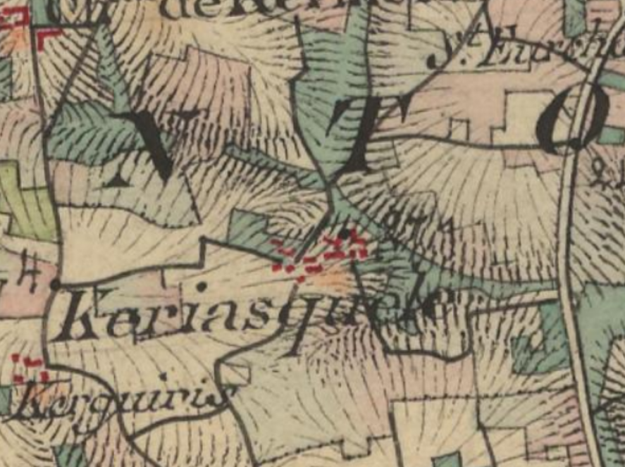
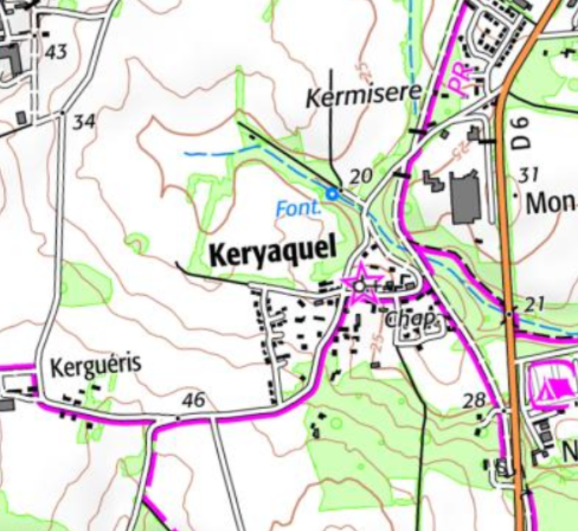

<!--  Copyright (C) 2015-2025 COMITE HISTOIRE ET PATRIMOINE DE CLEGUER / PONT SCORFF -->

# Keriaquel (Pont-Scorff)

Les graphies anciennes de ce village sont nombreuses et variées :

- K/yezequel 1413
- K/iezquel 1426
- K/jezecael 1426
- K/jezequel 1452, 1483, 1508
- K/iezecael 1572
- K/iaquel 1593
- K/iecael 1614
- K/icquel 1645
- K/iacquel 1652, 1668
- K/ieguel 1679
- K/yaquel 1731, 1754,1771,1783
- Cassini Keryaquel 1790
- K/iaquèle cadastre de 1818

Ce toponyme associe Ker au nom de personne Jezecael, issu du nomen Iedecael (Redon 869).
Dans ce village se trouve la chapelle de Saint-Gildas :

- Chapelle de monsieur Sainct Gilda 1616
- Chapelle Saint Gilda 1658,
- Saint Gildas 1783

*Carte de l'état-major (1820-1866)

*Carte SCAN25 © IGN 2025 – Copie et reproduction interdite*

---

Un texte de Michel Pothier. 

Source: « Des sources de l’Ellé à l’Île de Groix », Jean-Yves Plourin et Pierre Holloco, édition Emgleo Breiz, 2014.

Publié sur [la page Facebook du Comité d'Histoire](https://www.facebook.com/comitehistoire56620) le 10 janvier 2025.

Copyright &copy; Comité Histoire et Patrimoine de Cléguer Pont-Scorff
