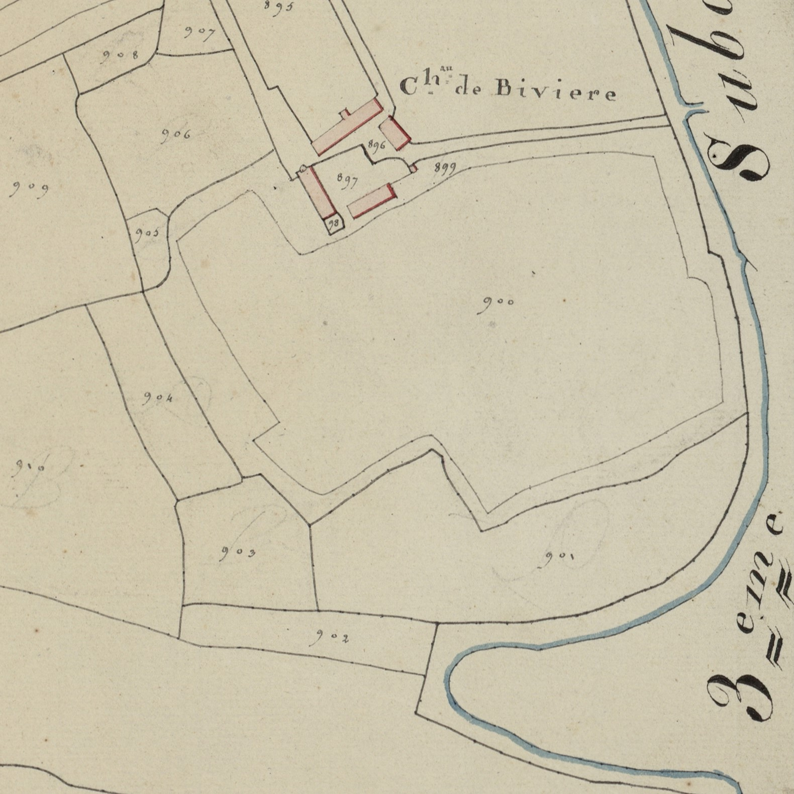
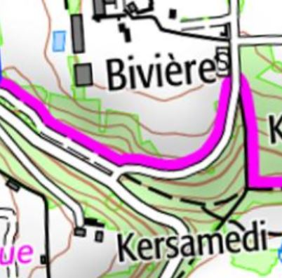

<!--  Copyright (C) 2015-2025 COMITE HISTOIRE ET PATRIMOINE DE CLEGUER / PONT SCORFF -->

# Bivière et Kersamedi (Pont-Scorff)

On trouve ici comme à Bremelin deux noms de lieu cités ensemble :
- Bivier 1689
- Lieu de Bivier et terre du Samedy 1705 et 1708
- manoir et methairie du lieu de Biviere 1705
- manoir de Biviere et grande methairie du lieu de Biviere 1783
- Bivieres Cassini 1790
- Château de Bivière cadastre de 1818

- Montagne du Samedy 1580, 1592
- Montaigne du Samdy 1603
- Montagne du Sambdy 1606
- La montagne du Sabmedi 1625,
- Terre du Samedy 1705
- Lande du Samedy 1778, 1785

En 1626, il n’y avait en ce lieu qu’ « une tenue par dehors près le Pont Scau et le village de K/morgant » (1) vendu par le Sieur du Talhoet en Guidel au Sieur Gacheau de Pont-Scorff. Cet endroit est progressivement érigé en métairie puis en manoir et métairie au cours du XVIIe siècle. Ce toponyme est peut-être un nom de personne.
Quant au nom de Samedy, il doit être rapproché des autres lieux du même nom en Plouray et Priziac : sam(p)dy maison, lieu de pacage (terrain où l'on fait paître les bestiaux).

(1) “Une tenue par dehors” est un domaine congéable qui ne comporte aucun édifice, uniquement des superficies.

*Cadastre napoléonien - Section D de Kermorvant, 2ème feuille, 1818. Patrimoines & Archives du Morbihan cote 3 P 225 12*

*Carte SCAN25 © IGN 2025 – Copie et reproduction interdite*

---

Un texte de Michel Pothier. 

Source: « Des sources de l’Ellé à l’Île de Groix », Jean-Yves Plourin et Pierre Hollocou, édition Emgleo Breiz, 2014.

Publié sur [la page Facebook du Comité d'Histoire](https://www.facebook.com/comitehistoire56620) le 17 janvier 2025.

Copyright &copy; Comité Histoire et Patrimoine de Cléguer Pont-Scorff
