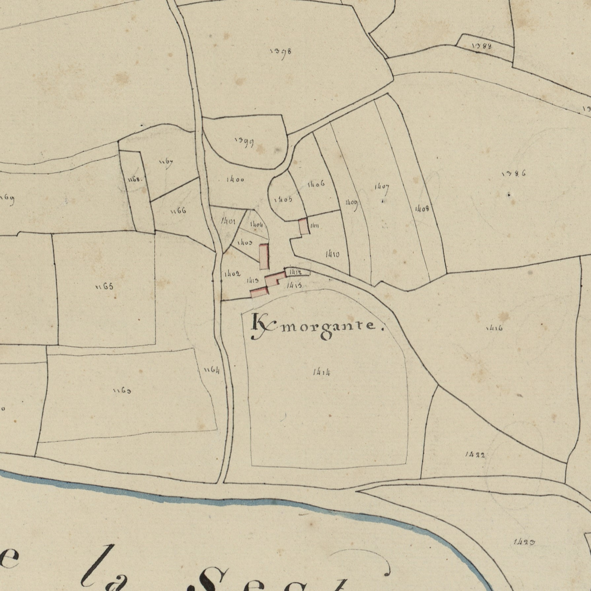
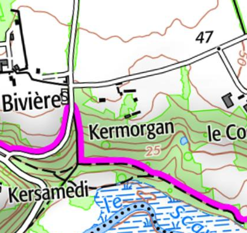

<!--  Copyright (C) 2015-2025 COMITE HISTOIRE ET PATRIMOINE DE CLEGUER / PONT SCORFF -->

# Kermorgant (Pont-Scorff)

Contrairement à d’autres toponymes celui-ci n’a pas vraiment varié au cours des siècles :

- K/morgant 1625 à 1785
- K/vorgant 1762
- K/morgan 1783
- K/morgante cadastre 1818

Ce toponyme associe Ker au nom de personne Morgant qui est un ancien nom celtique commun au gallois et au breton. Au Pays de Galles il donne son nom au Comté de Glamorgan dont Cardiff est la ville principale.

Ce nom de Morgant fut porté par un roi de l’ancienne île de Bretagne. Il est également cité dans le cartulaire de Quimperlé au début du XIe siècle.

*Cadastre napoléonien - Section C du Bourg, 3ème feuille, 1818. Patrimoines & Archives du Morbihan cote 3 P 225 10*

*Carte SCAN25 © IGN 2025 – Copie et reproduction interdite*

---

Un texte de Michel Pothier. 

Source: « Des sources de l’Ellé à l’Île de Groix », Jean-Yves Plourin et Pierre Hollocou, édition Emgleo Breiz, 2014.

Publié sur [la page Facebook du Comité d'Histoire](https://www.facebook.com/comitehistoire56620) le 24 janvier 2025.

Copyright &copy; Comité Histoire et Patrimoine de Cléguer Pont-Scorff
