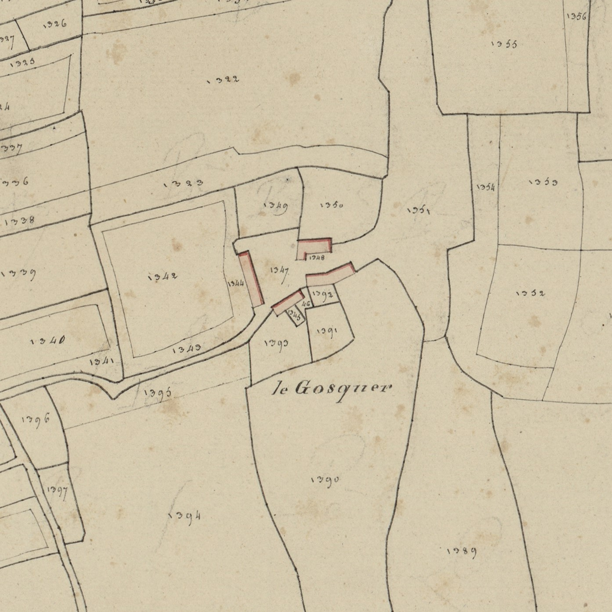
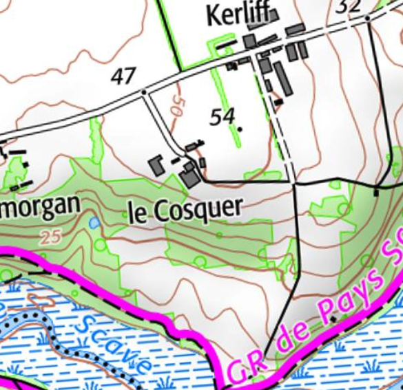

<!--  Copyright (C) 2015-2025 COMITE HISTOIRE ET PATRIMOINE DE CLEGUER / PONT SCORFF -->

# Le Cosquer

- Le Cozkaer 1500, 1508
- Le Cozker 1537
- Le Cozguer 1594
- Le Cozquer 1671
- Le Cosquer 1683 à 1790
- Le Gosquer cadastre de 1818

Ce toponyme associe l’adjectif coz (vieux) à ker (village). Le fait que l’adjectif soit placé avant le nom atteste de l’ancienneté du toponyme qui a été formé dans la période du parlé breton ancien (environ du Ve au Xe siècle).

Ce nom est porté par plus d’une centaine de villages rien que dans le Morbihan. Bien des Cosquer ont été des établissements Gallo-Romain que les premiers immigrants bretons ont trouvé en ruine à leur arrivée en Armorique aux IVe-Ve siècle. Les autres sont ceux détruits par les Normands aux IXe-Xe siècle et que les circonstances troublées ont fait abandonner pour un temps.

*Cadastre napoléonien - Section C du Bourg, 3ème feuille, 1818. Patrimoines & Archives du Morbihan cote 3 P 225 10*

*Carte SCAN25 © IGN 2025 – Copie et reproduction interdite*

---

Un texte de Michel Pothier. 

Source: « Des sources de l’Ellé à l’Île de Groix », Jean-Yves Plourin et Pierre Hollocou, édition Emgleo Breiz, 2014.

Publié sur [la page Facebook du Comité d'Histoire](https://www.facebook.com/comitehistoire56620) le 31 janvier 2025.

Copyright &copy; Comité Histoire et Patrimoine de Cléguer Pont-Scorff
