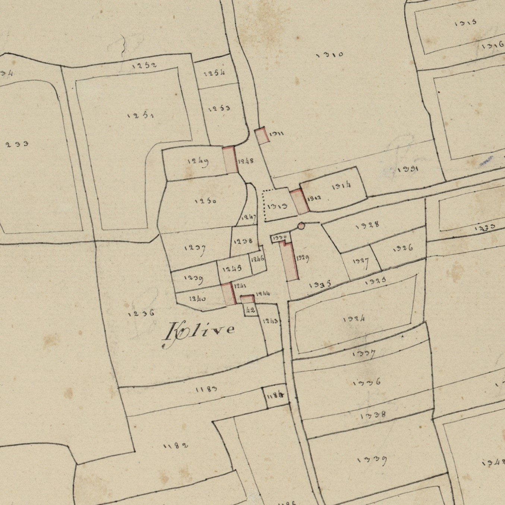
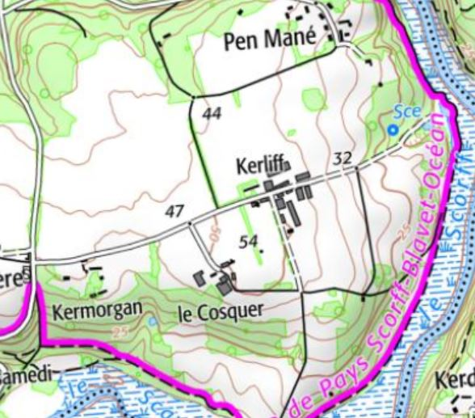

<!--  Copyright (C) 2015-2025 COMITE HISTOIRE ET PATRIMOINE DE CLEGUER / PONT SCORFF -->

# Kerliff (Pont-Scorff)

Ce nom a beaucoup évolué au cours des siècles :

- K/lev 1395
- K/anlev 1426
- K/lyv 1439
- K/liff 1508, 1565, 1607
- K/lifur 1614
- K/lif 1671
- K/leff 1674
- K/liff 1681, 1683,1702, 1778, 1785
- K/liffe 1731
- K/live 1752, 1762, 1783, cadastre 1818
- K/lifse 1771

Ce toponyme associe Ker et un nom de famille Le Leff (anlev 1426) attesté dans les Côtes d’Armor. Il se rattache au nom du cours d’eau Le Leff (lev en 1330), affluent du Trieux. Une paroisse qui le borde porte le nom de Lanfeff.

*Cadastre napoléonien - Section C du Bourg, 3ème feuille, 1818. Patrimoines & Archives du Morbihan cote 3 P 225 10*

*Carte SCAN25 © IGN 2025 – Copie et reproduction interdite*

---

Un texte de Michel Pothier. 

Source: « Des sources de l’Ellé à l’Île de Groix », Jean-Yves Plourin et Pierre Hollocou, édition Emgleo Breiz, 2014.
Publié sur [la page Facebook du Comité d'Histoire](https://www.facebook.com/comitehistoire56620) le 21 février 2025.

Copyright &copy; Comité Histoire et Patrimoine de Cléguer Pont-Scorff
