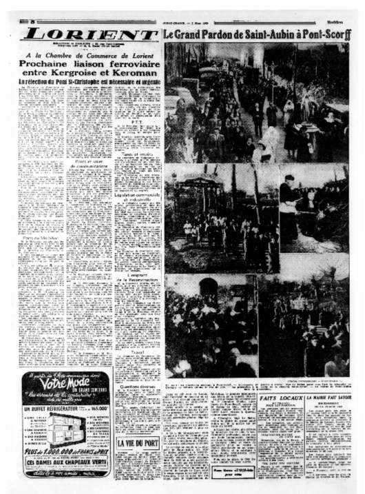
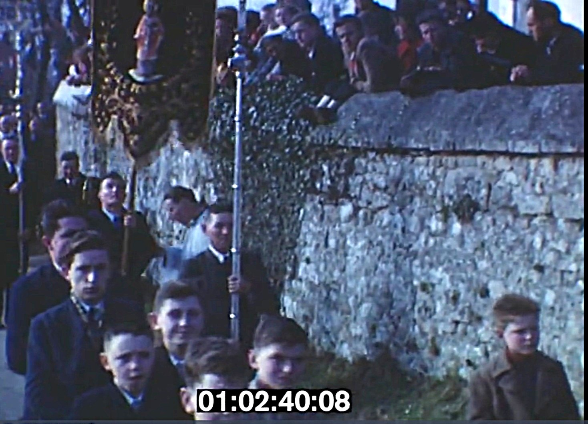

<!--  Copyright (C) 2015-2025 COMITE HISTOIRE ET PATRIMOINE DE CLEGUER / PONT SCORFF -->

# La Saint-Aubin et le nouveau clocher de Lesbin (1950)

Il y a 75 ans, Pont-Scorff fêtait Saint-Aubin et le nouveau clocher de Lesbin  

Le 02 mars prochain comme chaque premier dimanche de mars, Pont-Scorff fêtera Aubin. Les fidèles se retrouveront alors à la chapelle de Lesbin pour honorer le Saint-Patron de la paroisse. Un pardon, le 1er de l’année au sortir de l’hiver, qui drainait jadis la foule. 

Il y a tout juste 75 ans, la Saint-Aubin fut l’évènement du Pays du Pays de Lorient. Comme le relate Ouest France du 07 mars 1950,  le pardon « a revêtu un caractère tout particulier du fait de la présence de Mgr Le Bellec, évêque de Vannes, accompagné de son secrétaire général, Mgr Le Baron ». Un déplacement épiscopal pour la « bénédiction du nouveau clocher et de la chapelle rénovée. Cette dernière (…) a été partiellement détruite par les bombardements. (…) La grand’messe fut célébrée par M. le chanoine Guého, curé-doyen de Pont-Scorff. »

 L’après-midi, à l'issue des vêpres, « que clôtura un immense feu de joie, la traditionnelle procession déroula son long cortège pour se rendre à l'église paroissiale où un triomphant Gloria et le cantique à saint Aubin terminèrent cette magnifique journée. » 

La foule est estimée alors à 12.000 personnes ! Cela peut paraitre beaucoup, voir exagéré mais il faut rappeler l’importance de la vie religieuse et de ce pardon à l’époque pour tout le Pays de Lorient. La compagnie des chemins de fer du Morbihan qui gérait les autocars qui avaient définitivement supplantés « le train patate » en 1947 mettait ce jour-là des services de cars supplémentaires tant au départ de Plouay que de Lorient.

 Le public y venait aussi pour les réjouissances profanes et notamment sa fête foraine. En 1950, elle débutait le samedi en soirée et se prolongeait jusqu’au lundi inclus et « pour la 1ere fois tous les plus grands manèges s’y trouvent ». 

*Ouest-France du 07 mars 1950*

*Extrait du film amateur "Pardons Bretons" par Paul Lindu, Cinémathèque de Bretagne*

https://www.cinematheque-bretagne.bzh/voir-les-films-pardons-bretons-426-3309-0-1.html

---

Texte de Yvonnick Le Coupannec.

Source : Ouest-France, Cinémathèque de Bretagne.

Publié sur [la page Facebook du Comité d'Histoire](https://www.facebook.com/comitehistoire56620) le 23 février 2025.

Copyright &copy; Comité Histoire et Patrimoine de Cléguer Pont-Scorff
