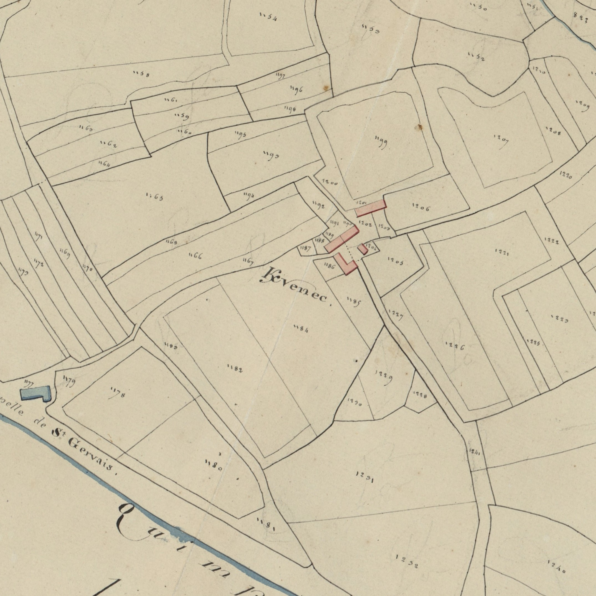
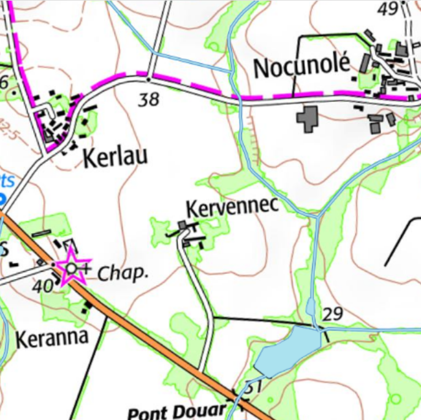

<!--  Copyright (C) 2015-2025 COMITE HISTOIRE ET PATRIMOINE DE CLEGUER / PONT SCORFF -->

# Kervennec (Pont-Scorff)

- K/maenec 1413, 1444
- Kmennec 1430
- K/maenec 1432
- K/menec 1559
- K/vennec 1661, 1671
- K/vehennec 1680, 1683
- K/huenec 1754
- K/venec 1720, 1730, 1762, 1790 et cadastre de 1818.

Ce toponyme associe Ker à Maenec qui peut être soit un nom de personne soit un nom de lieu pierreux. L’un et l’autre sont issus de maen qui signifie pierre. Le principal alignement des menhirs à Carnac est situé au lieu-dit Le Menec.

*Cadastre napoléonien - Section A de Kerleau, 3ème feuille, 1818. Patrimoines & Archives du Morbihan cote 3 P 225 10*

*Carte SCAN25 © IGN 2025 – Copie et reproduction interdite*

---

Un texte de Michel Pothier. 

Source: « Des sources de l’Ellé à l’Île de Groix », Jean-Yves Plourin et Pierre Hollocou, édition Emgleo Breiz, 2014.

Publié sur [la page Facebook du Comité d'Histoire](https://www.facebook.com/comitehistoire56620) le 9 mai 2025.

Copyright &copy; Comité Histoire et Patrimoine de Cléguer Pont-Scorff
