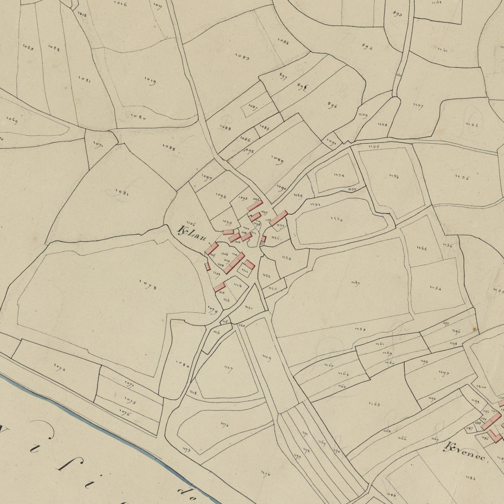
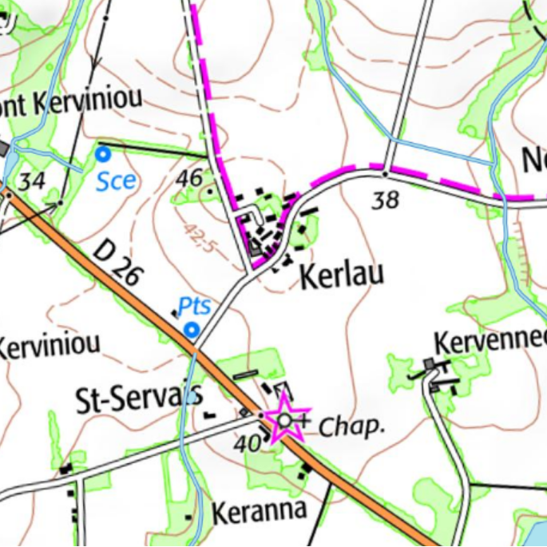

<!--  Copyright (C) 2015-2025 COMITE HISTOIRE ET PATRIMOINE DE CLEGUER / PONT SCORFF -->

# Kerleau

K/anleau 1426
K/haelou (K/leau mentionné en marge) 1443
K/hellou, K/haelou et K/haellou 1508
K/hellou 1559, 1565, 1607
K/lo 1642
K/lau 1645, 1646, 1652, 1661
K/laou 1680
K/helou, K/leau, K/helau 1683
K/hello 1702
K/lo et K/lau 1731
K/leau 1752, 1771 Cassini 
K/lou, K/lau 1790 et cadastre de 1818

Ce toponyme associe ker et le nom de personne Haelou composé de l’adjectif hael qui signifie généreux. Les noms de famille actuels issus de Haelou sont Hellou et Hello.

*Cadastre napoléonien - Section A de Kerleau, 3ème feuille, 1818. Patrimoines & Archives du Morbihan cote 3 P 225 5*

*Carte SCAN25 © IGN 2025 – Copie et reproduction interdite*

---

Un texte de Michel Pothier. 

Source: « Des sources de l’Ellé à l’Île de Groix », Jean-Yves Plourin et Pierre Holloco, édition Emgleo Breiz, 2014.

Publié sur [la page Facebook du Comité d'Histoire](https://www.facebook.com/comitehistoire56620) le 17 mai 2025.

Copyright &copy; Comité Histoire et Patrimoine de Cléguer Pont-Scorff
