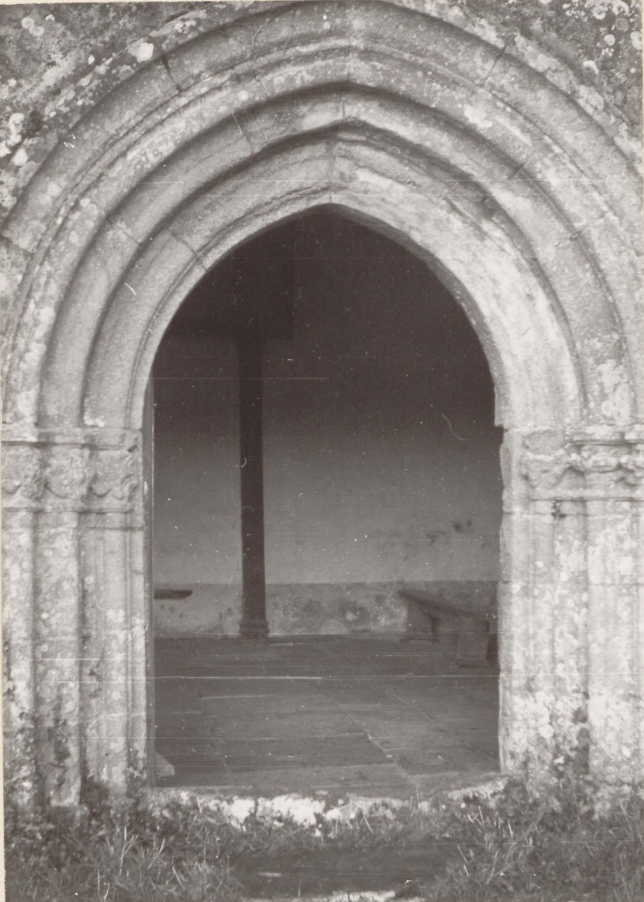
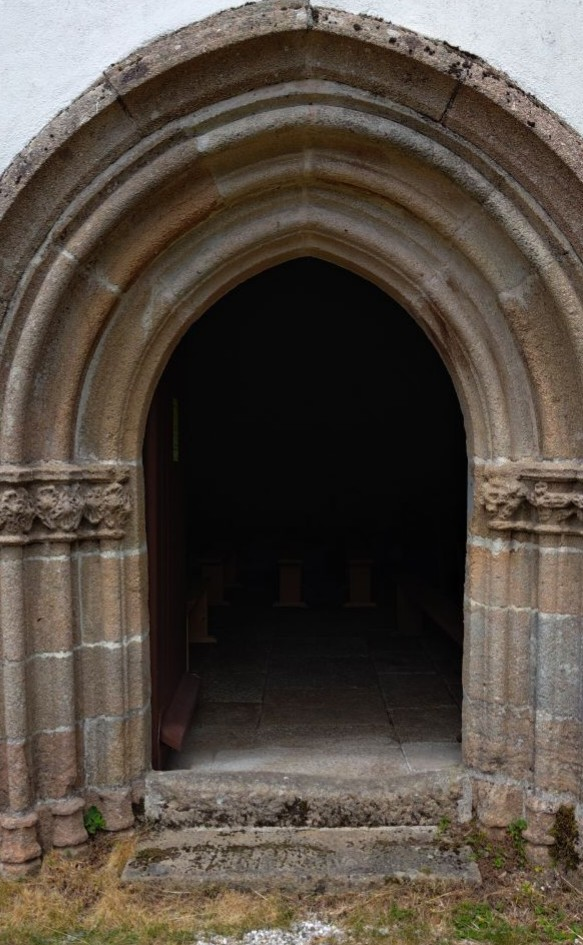

<!--  Copyright (C) 2015-2025 COMITE HISTOIRE ET PATRIMOINE DE CLEGUER / PONT SCORFF -->

# Chapelle Saint-Servais (Pont-Scorff)

Cela fait plus de 500 ans (seconde moitié du XVème siècle) qu’on peut admirer ses colonnettes surmontées de chapiteaux à décors végétaux. Si vous quittez Pont-Scorff en direction de Quimperlé, vous la verrez sur votre droite. N’hésitez pas à vous arrêter pour jeter un coup d'œil.

*En 1971, photo des Archives du Morbihan*

*En 2025, photo de Pierre-Loup Tristant*

---

Un texte de Pierre-Loup Tristant

Publié sur [la page Facebook du Comité d'Histoire](https://www.facebook.com/comitehistoire56620) le 20 juin 2025.

Copyright &copy; Comité Histoire et Patrimoine de Cléguer Pont-Scorff
