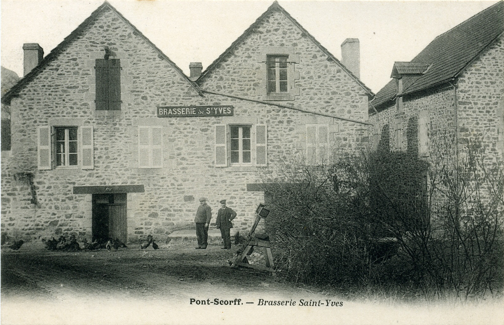
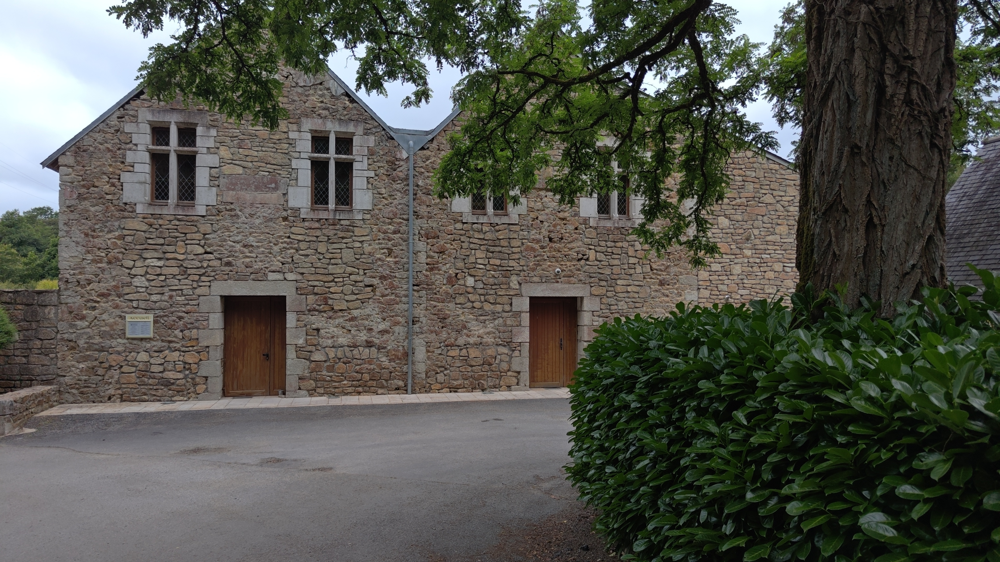

<!--  Copyright (C) 2015-2025 COMITE HISTOIRE ET PATRIMOINE DE CLEGUER / PONT SCORFF -->

# La brasserie de Saint-Yves (Cléguer)

Ce bâtiment, qui se trouve sur la berge côté Cleguer, fût autrefois une brasserie comme on peut le lire sur la devanture.

*Vers 1900, carte postale, collection privéee*

*En 2025, photo de Pierre-Loup Tristant*

---

Un texte de Pierre-Loup Tristant

Publié sur [la page Facebook du Comité d'Histoire](https://www.facebook.com/comitehistoire56620) le 27 juin 2025.

Copyright &copy; Comité Histoire et Patrimoine de Cléguer Pont-Scorff
