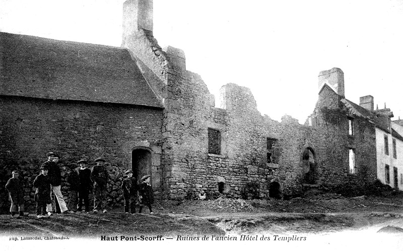
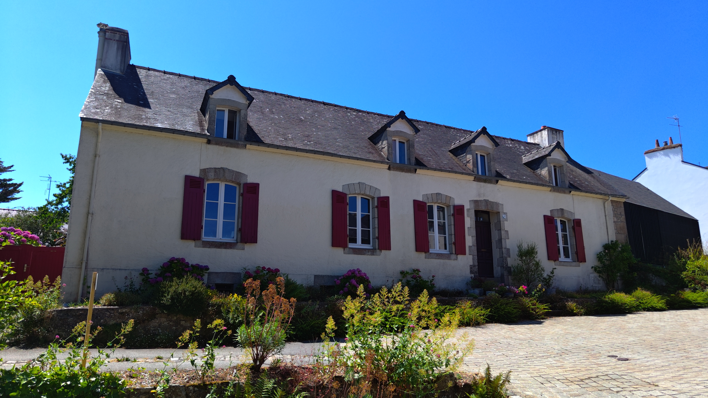

<!--  Copyright (C) 2015-2025 COMITE HISTOIRE ET PATRIMOINE DE CLEGUER / PONT SCORFF -->

# L'Hôtel des Templiers (Pont-Scorff)

Voici la photo originale qui mentionne "Ruines de l'ancien Hôtel des Templiers". Le bâtiment se trouvait Place de la Maison des Princes à l'emplacement de l'actuel numéro 38. Il a été détruit par un incendie en 1889.

La présence de l'ordre de l'ordre des Templiers à cet endroit n'est pas attestée. On ignore donc pourquoi le bâtiment portait ce nom. 

On sait cependant que l'ordre des Templiers était installé au Bas Pont-Scorff dès 1160, au niveau du vieux pont. L'établissement sera repris au XIV ème siècle par l'ordre des hospitaliers. On y voit encore aujourd'hui les ruines de la chapelle Saint-Jean.

*Vers 1900, carte postale, collection privéee*

*En 2025, photo de Pierre-Loup Tristant*

---

Un texte de Pierre-Loup Tristant

Publié sur [la page Facebook du Comité d'Histoire](https://www.facebook.com/comitehistoire56620) le 4 juillet 2025.

Copyright &copy; Comité Histoire et Patrimoine de Cléguer Pont-Scorff
