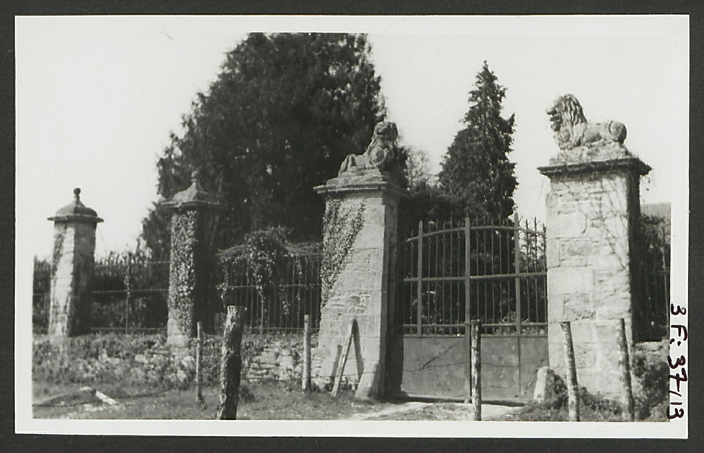
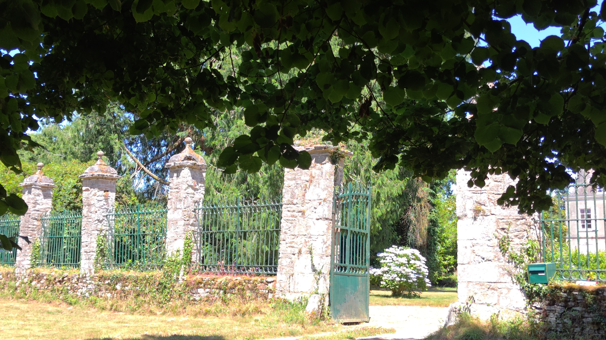

<!--  Copyright (C) 2015-2025 COMITE HISTOIRE ET PATRIMOINE DE CLEGUER / PONT SCORFF -->

# Château de Meslien (Cléguer)

Les piliers sont ornés de lions couchés. Ils portent les armes des Robecq qui ont construit l’édifice actuel en 1783.

*En 1934, photo des Archives du Morbihan*

*En 2025, photo de Pierre-Loup Tristant*

---

Un texte de Pierre-Loup Tristant

Publié sur [la page Facebook du Comité d'Histoire](https://www.facebook.com/comitehistoire56620) le 13 juillet 2025.

Copyright &copy; Comité Histoire et Patrimoine de Cléguer Pont-Scorff
