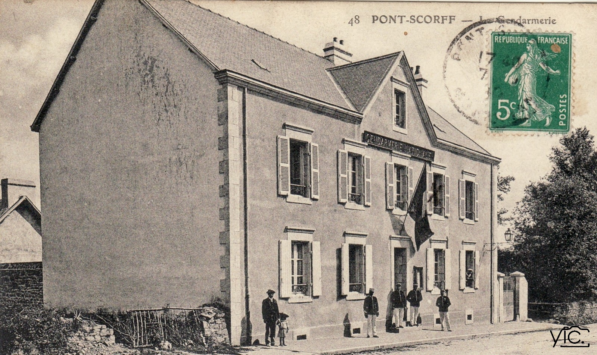
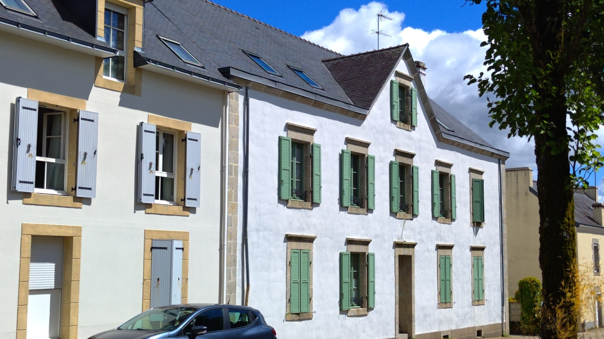

<!--  Copyright (C) 2015-2025 COMITE HISTOIRE ET PATRIMOINE DE CLEGUER / PONT SCORFF -->

# L'Ancienne Gendarmerie (Pont-Scorff)

Elle se trouvait rue du Général de Gaulle à Pont-Scorff. Le bâtiment a été rénové dans les années 2000.

*Vers 1900, carte postale, collection privéee*

*En 2025, photo de Pierre-Loup Tristant*

---

Un texte de Pierre-Loup Tristant

Publié sur [la page Facebook du Comité d'Histoire](https://www.facebook.com/comitehistoire56620) le 21 juillet 2025.

Copyright &copy; Comité Histoire et Patrimoine de Cléguer Pont-Scorff
