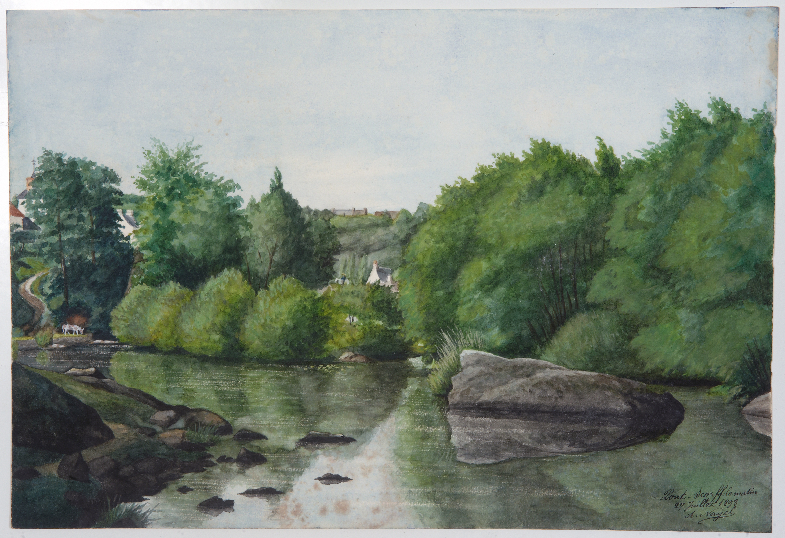
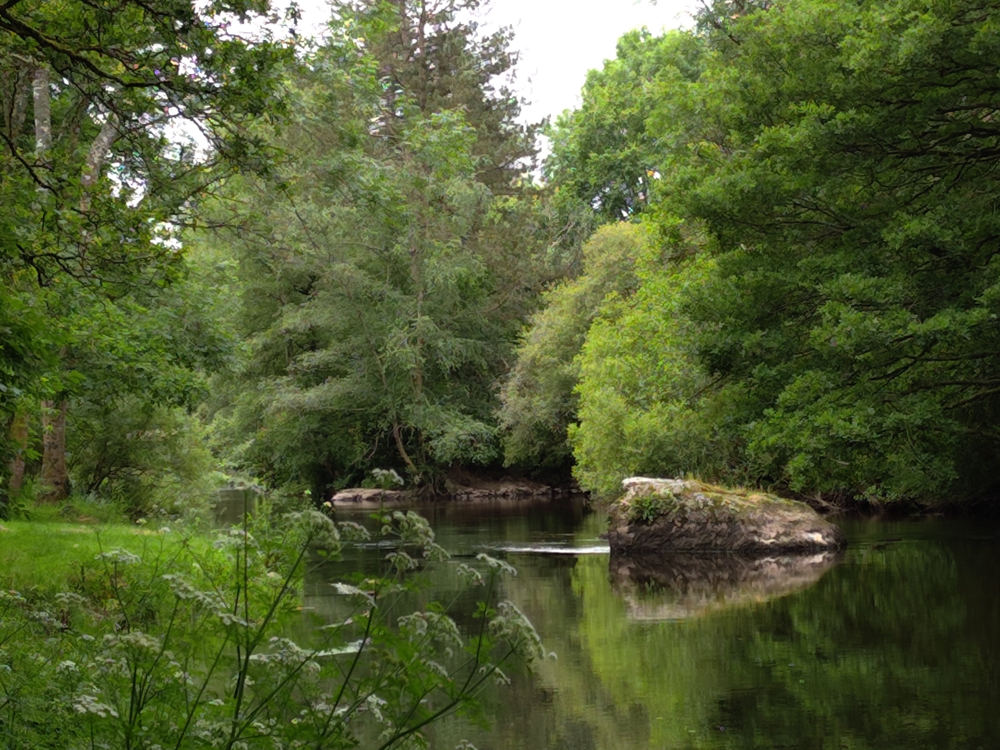

<!--  Copyright (C) 2015-2025 COMITE HISTOIRE ET PATRIMOINE DE CLEGUER / PONT SCORFF -->

# La roche du Moulin des Princes 

Sur le tableau, en bas à droite, on peut lire “Pont-Scorff le matin, 27 juillet 1893”. Il est signé par Auguste Nayel, le sculpteur et dessinateur lorientais. La photo actuelle est prise côté Cleguer.

*En 1893, tableau d'Auguste Nayel, collection privée*

*En 2024, photo de Pierre-Loup Tristant*

---

Un texte de Pierre-Loup Tristant

Publié sur [la page Facebook du Comité d'Histoire](https://www.facebook.com/comitehistoire56620) le 14 août 2025.

Copyright &copy; Comité Histoire et Patrimoine de Cléguer Pont-Scorff
