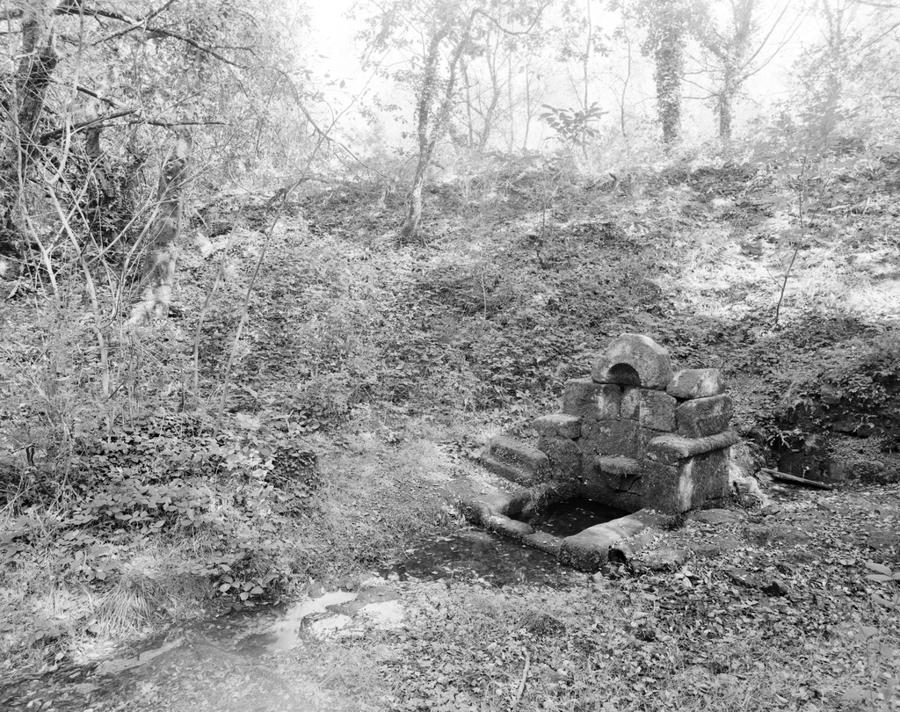
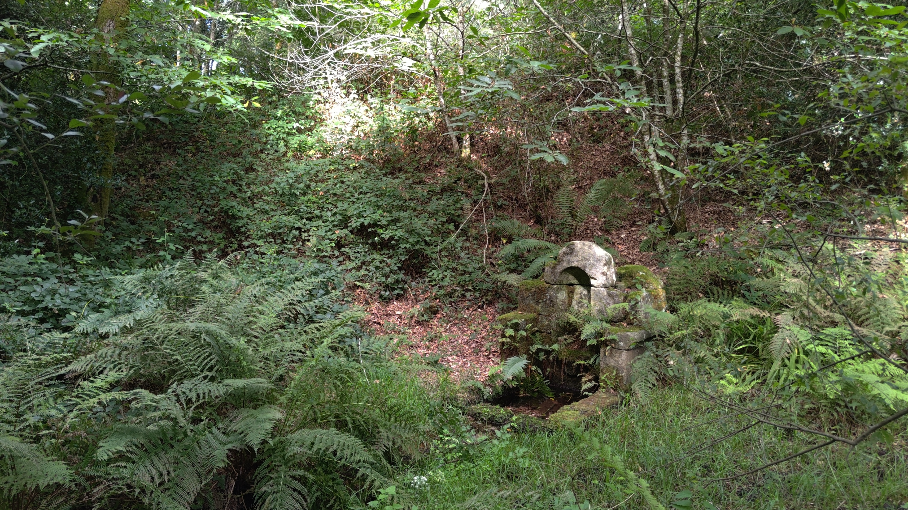

<!--  Copyright (C) 2015-2025 COMITE HISTOIRE ET PATRIMOINE DE CLEGUER / PONT SCORFF -->

# Fontaine Saint-Paul (Cléguer)

La fontaine se trouve tout proche du village du Vizit à Cleguer.

️ Photo 1997: © Inventaire Général ADAGP
Photo aujourd’hui: © 2025 par Pierre-Loup Tristant sous license CC BY 4.0

*En 1997, photo de l'Inventaire Général ADAGP*

*En 2025, photo de Pierre-Loup Tristant*

---

Un texte de Pierre-Loup Tristant

Publié sur [la page Facebook du Comité d'Histoire](https://www.facebook.com/comitehistoire56620) le 24 août 2025.

Copyright &copy; Comité Histoire et Patrimoine de Cléguer Pont-Scorff
