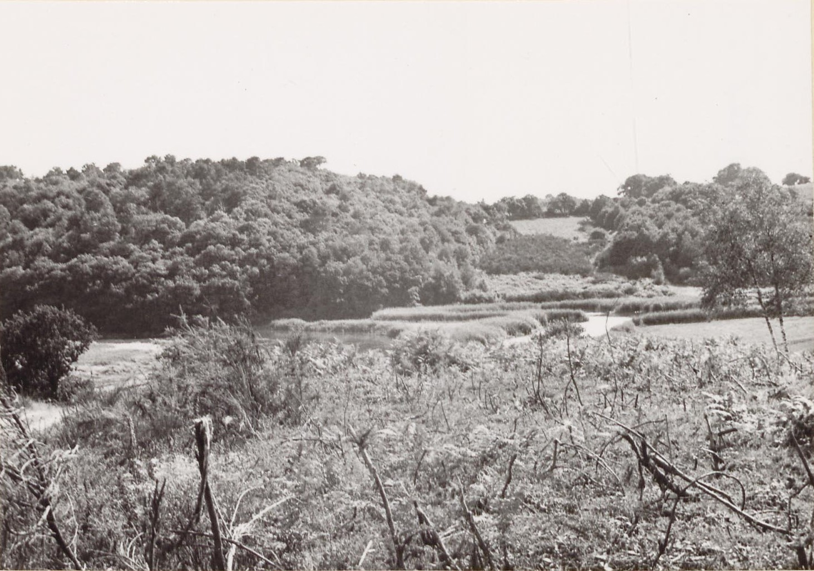
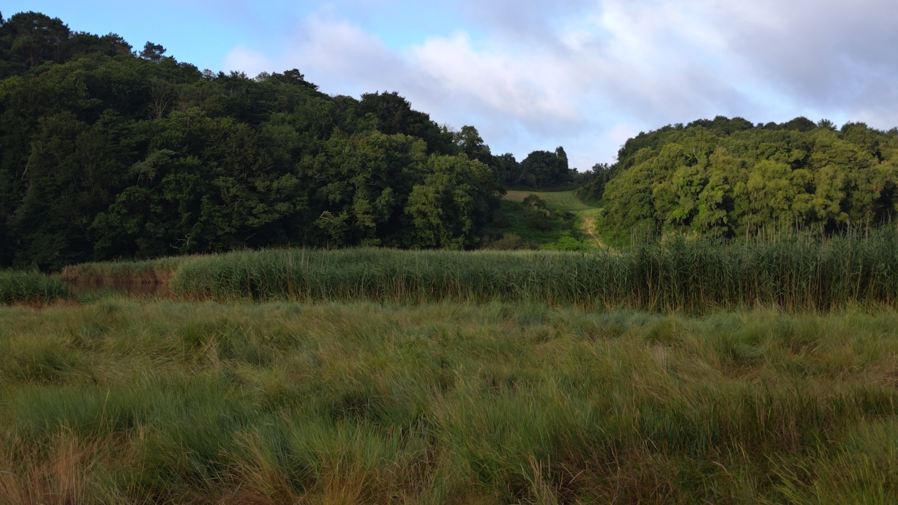

<!--  Copyright (C) 2015-2025 COMITE HISTOIRE ET PATRIMOINE DE CLEGUER / PONT SCORFF -->

# Confluence Scorff-Scave à Pont-Scorff

Cette photo a été prise à la confluence du Scorff et du Scave, en contrebas du village du Cosquer.

Pour s'y rendre à pied : départ du parking Les Terres de Nataé et suivre le circuit de Saint-Urchaut vers l'est.

*En 1971, photo des Archives du Morbihan*

*En 2025, photo de Pierre-Loup Tristant*

---

Un texte de Pierre-Loup Tristant

Publié sur [la page Facebook du Comité d'Histoire](https://www.facebook.com/comitehistoire56620) le 29 août 2025.

Copyright &copy; Comité Histoire et Patrimoine de Cléguer Pont-Scorff
