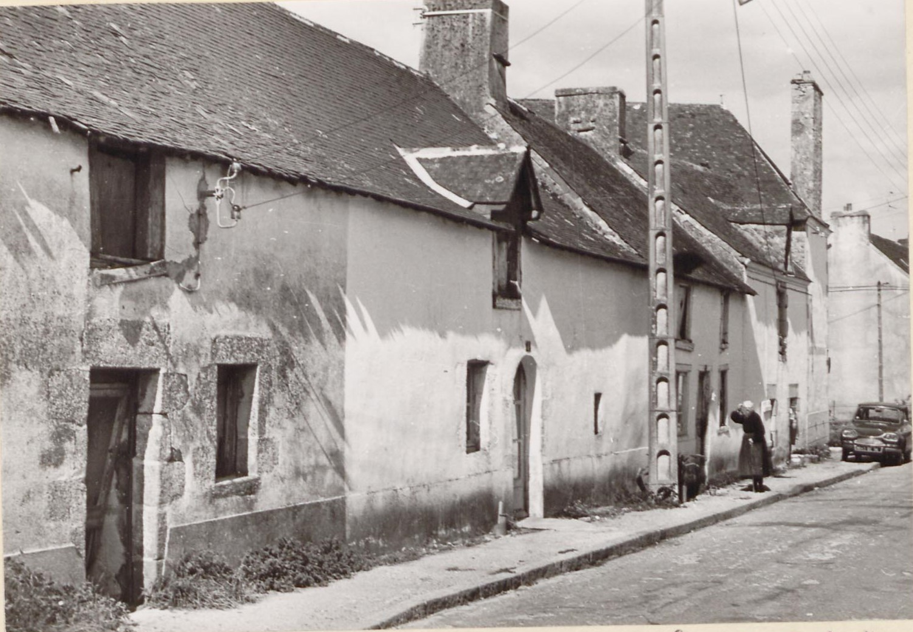
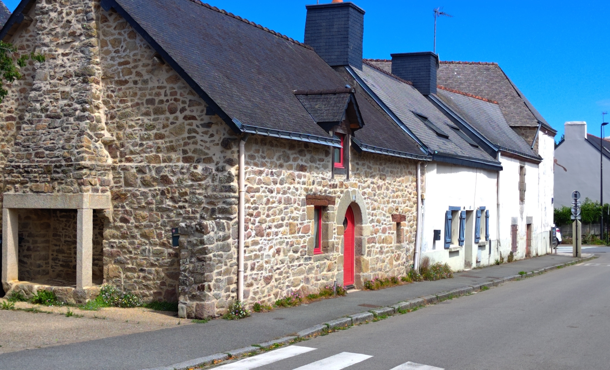

<!--  Copyright (C) 2015-2025 COMITE HISTOIRE ET PATRIMOINE DE CLEGUER / PONT SCORFF -->

# Rue Docteur Rialland à Pont-Scorff

A l'angle de la rue se trouvait le Bar du Stade que l'on connaît mieux sous le nom "Chez Minouche".

*En 1971, photo des Archives du Morbihan*

*En 2025, photo de Pierre-Loup Tristant*

---

Un texte de Pierre-Loup Tristant

Publié sur [la page Facebook du Comité d'Histoire](https://www.facebook.com/comitehistoire56620) le 9 septembre 2025.

Copyright &copy; Comité Histoire et Patrimoine de Cléguer Pont-Scorff
